<p align="center">
  
</p>

# SerialDesk

**串口台 —— 让串口调试回归它本该有的样子：插上、打开、收发、存档，不折腾。**

***SerialDesk (串口台) — serial debugging the way it should be: plug in, open, send, receive, done. A clean, capable, cross-platform serial debugging tool that keeps growing.***

基于 **PySide6 + PySerial**，面向嵌入式 / 电机控制 / 工业控制工程师。

*Built on **PySide6 + PySerial**, for embedded, motor-control and industrial-control engineers.*

**下载 / Download:** [Windows x64 安装包 · installer](https://github.com/QuAndy2016/SerialDesk/releases/latest) · [便携 zip · portable zip](https://github.com/QuAndy2016/SerialDesk/releases/latest) · [源代码 · source](https://github.com/QuAndy2016/SerialDesk)

**Language:** 中文（本页）· [English](#english-version) — the full English README is the collapsible block at the bottom.

---

## What is it (English)

A cross-platform serial debugging tool for embedded, motor-control and industrial-control engineers, built on **PySide6 + PySerial**: HEX and ASCII views, framing, timestamps, CRC16 / CRC32 / SUM8, quick-send banks, command sequences, file transfer, receive logs that save themselves, and a UI in Chinese and English — shipped as a single-file Windows installer or a portable zip.

**Download:** [Windows x64 · installer](https://github.com/QuAndy2016/SerialDesk/releases/latest) — no Python needed. The exe is unsigned, so Windows may warn on first run; the three-step fix is in ***Download for Windows*** below.

**Full English README** → [click here](#english-version) (or scroll to the bottom of this page).

---

## 这是什么

串口是嵌入式世界里最古老、也最可靠的接口。每一次点亮一块新板子、每一条 Modbus 报文、每一段固件升级日志，最后都要落在屏幕上一行行滚动的字节里。

但真正顺手的串口工具并不多：功能强的往往界面停留在上个十年，清爽的又缺了工程师每天都要用的那几个开关。这个项目想做的事很朴素 —— 界面现代、开箱即用、开源可改，把日常调试里最高频的能力一次做对。

它不追求功能堆叠，只想成为你调试时最不需要思考的那一个窗口。

## 下载与安装（Windows 64 位，无需 Python）

到 [Releases 页面](https://github.com/QuAndy2016/SerialDesk/releases/latest) 下载。每个版本带 4 个文件：

| 文件 | 说明 |
|------|------|
| `SerialDesk_vX.Y.Z-win64-setup.exe` | **安装版**（约 24 MB）：双击安装，自动创建开始菜单项与卸载入口，可选创建桌面快捷方式；**安装时可自选安装目录与日志默认目录**；装完可直接勾选运行 |
| `SerialDesk_vX.Y.Z-win64.zip` | **免安装版**（约 34 MB）：解压即用，整个目录一起拷贝即可带走，适合 U 盘 / 绿色部署 |
| `SerialDesk_vX.Y.Z-win64-setup.exe.sha256` | 安装版的 SHA256 校验文件 |
| `SerialDesk_vX.Y.Z-win64.zip.sha256` | 免安装版的 SHA256 校验文件 |

**怎么选**：想装进系统、要开始菜单和卸载项 → 安装版（setup.exe）；想绿色便携、不想动系统 → 免安装版（zip）。

两种方式共同点与注意：
- 都是 64 位 Windows 程序，已内置 Python 运行时，**不需要另装 Python**
- zip 版请**解压整个目录再运行**，不要把 exe 单独拷出来（同目录的文件夹是运行库）
- **便携模式**：在 exe 同目录放一个空的 `portable.txt`，配置与日志就写在程序目录；否则写在 `%APPDATA%\SerialDesk`
- **校验下载**：`certutil -hashfile SerialDesk_vX.Y.Z-win64.zip SHA256`，与对应 `.sha256` 文件里的值比对

## 功能

### 连接与串口参数

| 功能 | 说明 |
|------|------|
| 串口枚举自动刷新 | 3 秒轮询，插拔自动感知；下拉显示完整设备名（COM5 — USB-SERIAL CH340） |
| 波特率 | 26 档预设（110 ~ 3000000），支持自定义输入（非法值即时红框提示） |
| 完整串口参数 | 数据位 5~8 / 停止位 1·1.5·2 / 校验 无·奇·偶·Mark·Space / 流控 无·软件·硬件（打开端口时生效） |
| DTR/RTS 控制 + 信号线监视 | 控制 DTR/RTS 输出，实时显示 CTS/DSR/DCD/RI（50 ms 刷新） |
| 断线自动重连 | 端口异常断开后自动尝试恢复 |
| 界面语言 / 主题 | 中文·English·跟随系统；深色·浅色·跟随系统，均持久化 |

### 收发与显示

| 功能 | 说明 |
|------|------|
| 接收格式 | ASCII / HEX / HEX+ASCII 双显示 / 列式 HEX（16 字节一行 + 偏移 + ASCII 对照） |
| 分包模式 | 不分包 / 自动按波特率（3.5 字符法则）/ 手动 ms / 按帧头 / 定长 / 起止定界 / 长度前缀 |
| 时间戳前缀 | 不显示 / HH:MM:SS / HH:MM:SS.mmm / 完整日期毫秒 |
| 收发同屏 | 发送内容回显到接收区：TX 行 `->`、RX 行 `<-`，等宽标记不打乱 HEX 对齐，可一键关闭 |
| 视图过滤 | 全部 / 只看接收 / 只看发送（过滤在片断层生效，标记不串行） |
| 关键词高亮 | 常驻高亮条：输入即高亮、不抢滚动位置，大小写可选；新到的数据同样即时高亮 |
| 多编码 | 接收与发送支持 ASCII / UTF-8 / GBK / GB2312，中文报文不再乱码 |
| 转义解析开关 | `\r \n \t \xNN` 可解析为控制字符，也可按字面原样发送（入口在发送行的「发送设置」芯片内） |
| 状态栏 | 收发字节计数（等宽）+ 端口与波特率 + 连接状态灯；接收吞吐仪表：1 秒滚动窗口显示速率 / 批每秒 / 每批合并片段数 / 单批最坏耗时 / 丢帧计数 |

### 发送与快捷发送

| 功能 | 说明 |
|------|------|
| 校验追加套件 | CRC16-Modbus / CRC16-CCITT / CRC32 / SUM8 |
| 追加 `\r\n` | ASCII 模式下发送自动追加回车换行（AT 指令常用）；**快速发送的 ASCII 行同样追加**；HEX 模式下选择器可见但禁用（按字节原样发送，需要行尾自己写 `0D 0A`） |
| 定时循环发送 | 点一下开始、再点一下停止（运行中按钮显示「停止循环」），10~60000 ms 间隔；间隔与次数收在旁边的芯片里 |
| 重复发送次数 | 循环可设次数；0 �  不限次数（显示 ∞，手动停止） |
| 快速发送面板 | 默认 10 条、最多 99 条指令，config.json 持久化，重启不丢；勾选行或单击行即选中，点「删除」即可删除（3 秒内可撤销） |
| 命令名称 + 备注 | 每条可填名称与备注（行内两行显示，右键编辑备注），旧配置无损迁移 |
| 发送内容自动递增 | `{i}` 占位符在发送前替换为递增计数，详见下方示例 |
| 指令序列 | 序列模式：每条指令自带延迟，点「运行」按序自动发出（上电时序、AT 初始化）；头部显示「已发 N 次」，正在发送的那一行高亮 |
| 发送历史 | 最近 50 条自动记录、去重、持久化；弹窗可筛选，每条带格式/字节数/时间；**支持多选（Ctrl/Shift）与 Ctrl+A 全选后批量删除**；双击或回车回填；清空需二次确认 |
| 发送文件 | 文本 / HEX / 二进制按 4 KB 分块发送，带进度条与预计耗时，可中途取消（入口在「发送设置」芯片内，发送中行内显示「取消发送」） |

#### 示例：发送内容自动递增 `{i}`

占位符写在发送内容里，发送前会根据「递增」面板的设置（起始值 / 步长 / 位宽 / 字节序 / 进制 / 回绕）替换成具体数值；发送历史只记录模板。

| 占位符 | 含义 |
|--------|------|
| `{i}` | 按设置位宽输出十进制计数 |
| `{i:N}` | 指定位宽 N（不足前补 0），如 `{i:4}` → 0001 |
| `{i:N:le}` | 位宽 N + 小端字节序（HEX 模式常用） |
| `\{i}` | 转义，输出字面量 `{i}`，不递增 |

| 模板（HEX） | 设置 | 第 1 次发出 | 第 2 次发出 |
|-------------|------|-----------|-----------|
| `AA 55 {i:2} 0D` | 起始 1 / 步长 1 / 位宽 2 / 大端 | `AA 55 00 01 0D` | `AA 55 00 02 0D` |
| `01 10 {i:2:le} 00 02` | 起始 1 / 位宽 2 / 小端 | `01 10 01 00 00 02` | `01 10 02 00 00 02` |

到上限时：勾选「回绕」则回到起始值继续，不勾则自动停止循环/序列并提示。

### 日志、自动化与配置

| 功能 | 说明 |
|------|------|
| 接收日志保存 | 一键保存到日志目录（状态栏给出路径）、另存为…；自动保存开关、单文件上限、时长、日志目录统一在「设置 → 日志保存设置…」 |
| 自动应答规则 | 收到指定匹配串自动回复指定内容，规则可增删改并持久化（HEX 模式可选） |
| 配置导入导出 | 快速发送列表、主题、语言、发送历史、自动应答规则打包成一个 JSON，换机器导入即恢复 |

### 工程与打包

| 功能 | 说明 |
|------|------|
| 背景 QThread 读取 | 串口 I/O 在后台线程，UI 永不卡顿 |
| 正式图标 | 窗口 / 任务栏 / EXE 文件图标 |
| 打包 | 安装版（setup.exe）与免安装 zip，均内置 Python 运行时 |

### 界面一览

<p align="center">
  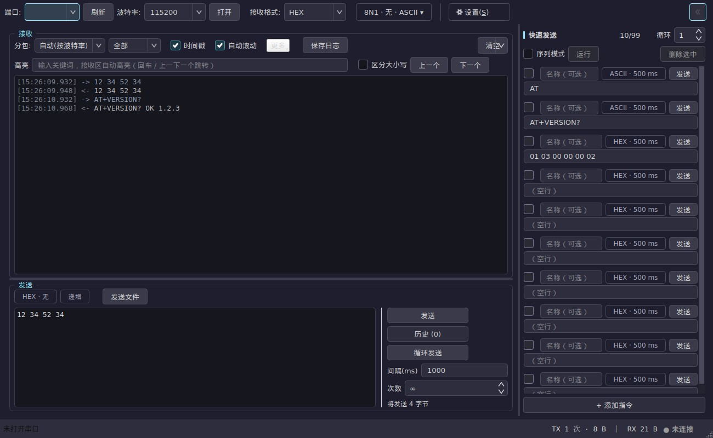
  <br>
  <sub>主界面 · 深色主题（收发/时间戳/校验/快捷发送，中英双语）</sub>
</p>

<p align="center">
  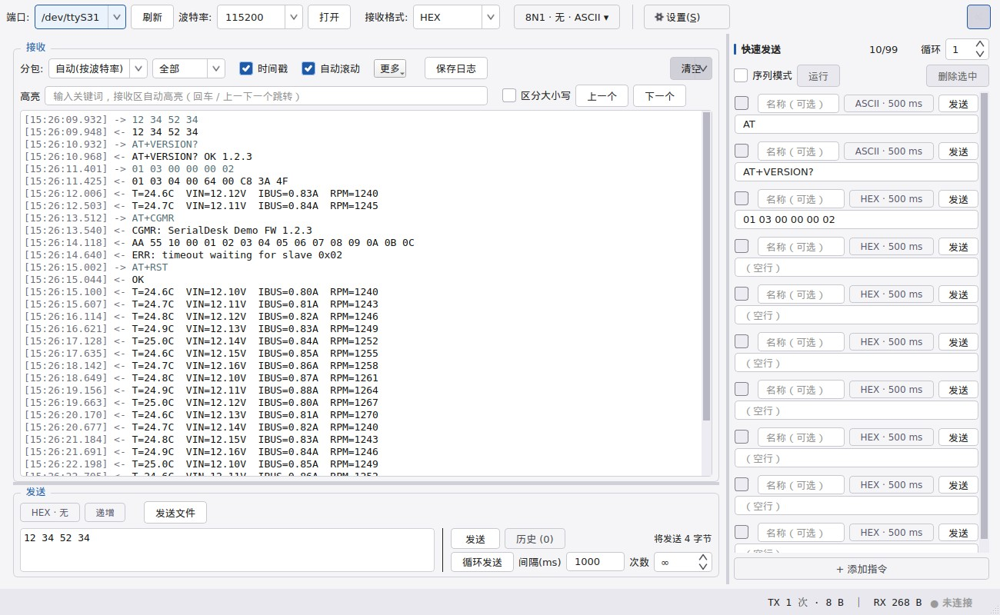
  <br>
  <sub>主界面 · 浅色主题（主题可跟随系统）</sub>
</p>

<p align="center">
  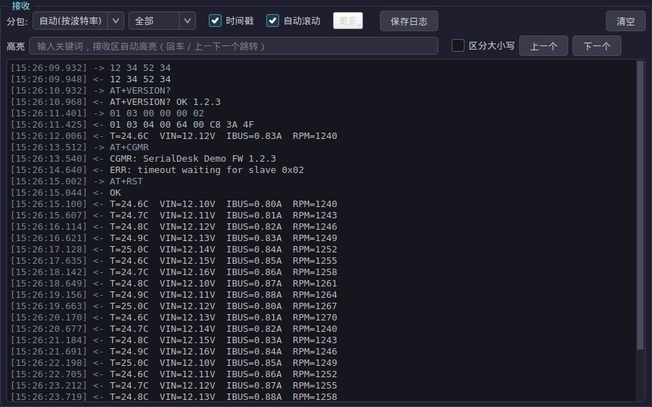
  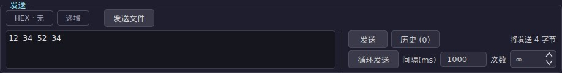
  <br>
  <sub>接收区（关键词高亮 · 视图过滤 · 时间戳）· 发送区（左侧输入，右侧发送与循环按钮）</sub>
</p>

<p align="center">
  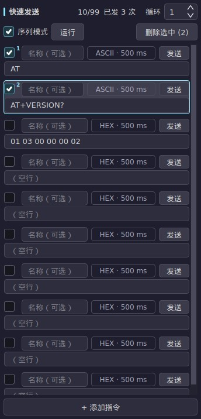
  <br>
  <sub>快速发送面板：序列模式 · 已发次数 · 发送中高亮</sub>
</p>

<p align="center">
  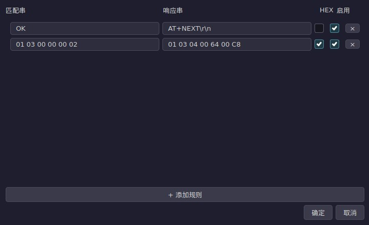
  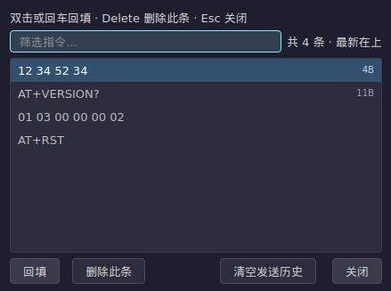
  <br>
  <sub>自动应答规则 · 发送历史（含格式 / 字节数）</sub>
</p>

<p align="center">
  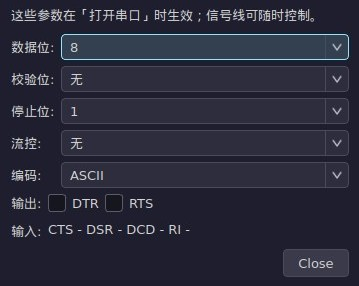
  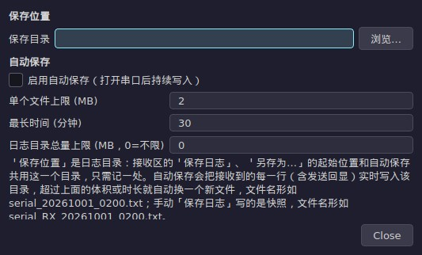
  <br>
  <sub>串口参数设置（数据位 / 停止位 / 校验 / 流控）· 日志保存设置</sub>
</p>

<p align="center">
  
  <br>
  <sub>快捷键一览</sub>
</p>

## 开发进度

- **已发布**：78 个版本标签（最新 **v1.8.9**），151 次提交，155 条自动化测试全绿
- **已完成**：串口收发全链路（HEX/ASCII、分包、时间戳、校验、日志、发送历史、自动应答、断线重连）、快速发送（序列/循环/递增/命名备注）、接收增强（关键词高亮、视图过滤、列式 HEX、复制语义）、中英双语 + 深浅主题、Windows 安装器与免安装包
- **待开发**：33 项（协议解析层、波形显示、小工具箱、多串口、终端模式等；完整清单在开发任务文档里）

**下一个开发任务（仅此一项）**：声明式协议解析（B4-P1）—— 免脚本的字段化解析：帧头 / 字段长度 / 数据类型（含 float、大小端）/ 校验规则，内置 Modbus RTU、AT、NMEA 模板；先做纯解析内核 + 单测，再接字段面板。

## 路线图

| 版本 | 内容 | 状态 |
|------|------|------|
| v0.1.0 | 基础收发 + HEX/ASCII + CRC16 | ✅ 已完成 |
| v0.2.0 | 格式下拉 / 分包 / 毫秒时间戳 / 校验套件 / 快速发送 / 主题 | ✅ 已完成 |
| v0.2.1 ~ v0.2.13 | UI 修复、图标、版本号、Releases 发布（onedir + zip）、主题一致性、快速发送默认 10 条、波特率输入框可用性、README 双语 | ✅ 已完成 |
| v0.3.0 | 完整串口参数（数据位/停止位/校验/流控）、循环发送、追加 \r\n、日志保存、发送历史 | ✅ 已完成 |
| v0.4.0 | 文件发送、多编码（UTF-8/GBK）、转义解析、DTR/RTS 控制、自动应答规则 | ✅ 已完成 |
| v0.5.0 | 批量可用性（快捷键 / 查找 / 关于 / 自动滚动 / 可撤销清空）、指令序列、配置导入导出、断线自动重连 | ✅ 已完成 |
| v0.6.0 ~ v0.9.0 | 单文件 Windows 安装器 + 打包瘦身、发送历史弹窗、接收区控制条分组重排、布局最小宽度按实测 | ✅ 已完成 |
| v0.10.0 ~ v0.14.0 | 发送历史弹窗升级（条数行 / 过滤 / 元信息 / 尺寸记忆）、接收区三简化、日志保存设置整合、发送区两次重构、连接行中文化、分隔条不再裁字 | ✅ 已完成 |
| **v1.0.0** | **首个稳定版**：功能面收敛 —— 收发 / HEX / 分包 / 时间戳 / 校验 / 快速发送 / 指令序列 / 文件发送 / 自动应答 / 断线重连 / 日志 / 中英双语 / 安装器，进入长期维护 | ✅ 本次发布 |
| **v1.1.0** | 快速发送面板改造（行内两段式 + 折叠双向、折叠态窄轨）、发送计数口径统一、延迟单位、修复折叠导致配置被清空的缺陷 | ✅ 本次发布 |
| **v1.2.0** | 发送区与快速发送面板的设计改进：数据区优先的高度分配、换行符选择、设置入口、选中态生命周期、行内两段式细节 | ✅ 本次发布 |
| **v1.3.0** | 快速发送面板与发送区空间优化：单行条目 + 属性芯片、多选删除、发送选项芯片、输入框吸收富余高度、面板折叠零占位 | ✅ 本次发布 |
| **v1.4.0** | 质量批：键盘焦点环与无障碍名、诊断信息与崩溃日志、状态栏计数合并（等宽）、快捷键一览、CI 测试门禁 | ✅ 本次发布 |
| **v1.5.0** | 启动时静默检查新版本（可关、失败静默、不发送本机信息），有新版本时状态栏提示 + 设置菜单直达下载页 | ✅ 已完成 |
| **v1.6.0 ~ v1.6.3** | UI 批 A-D：居中图标与双折角、四类收/发过滤、接收行重排、面板标题、清空分体按钮、发送框换行、端口下拉显示全名 | ✅ 已完成 |
| **v1.7.0** | 序列循环轮数、重复发送次数，UI 批 A-D 收口（图标重绘、行重排、过滤缺陷修复） | ✅ 已完成 |
| **v1.8.0** | 发送区 `{i}` 自动递增、接收区常驻关键词高亮条、快速发送命令名称 + 备注（两行、无损迁移） | ✅ 已完成 |
| **v1.8.1** | 修复与打磨：新数据即时高亮、序列「已发 N 次」计数 + 当前发送行高亮、折叠控件去重、SpinBox 上下箭头与清空下拉箭头放大 | ✅ 已完成 |
| **v1.8.2** | 发送区按分区标注（发送内容区 / 循环发送 / 发送·历史）、打勾即可删除选中、折叠按钮移至连接行最右端 | ✅ 已完成 |
| **v1.8.3** | 发送区改版：输入框在左、发送 / 历史 / 循环控件成列在右（发送按钮顺手），面板最小高度 335→235px | ✅ 已完成 |
| **v1.8.4** | 发送区收敛为两段：设置行在上，下面一行左右分栏（左输入框 / 右发送·历史·循环紧凑列，与输入框顶对齐） | ✅ 已完成 |
| **v1.8.5** | 发送区压到约两行按钮高、按钮缩小并列，输入框默认自动换行 + 垂直滚动，数据区默认获得更多高度 | ✅ 已完成 |
| **v1.8.6** | 修复：发送历史列表跟随应用主题（非 Windows 平台原本会发白）；README 图廊重做（内容饱满、整体图整宽、中英各 10 张） | ✅ 已完成 |
| **v1.8.7** | 发送历史支持多选（Ctrl/Shift）与 Ctrl+A 全选批量删除；README 文档大幅重整（下载章节按资产逐个说明、功能分类表格 + `{i}` 示例、开发进度块） | ✅ 已完成 |
| **v1.8.8** | 换行不再需要设置：发送框与接收区一律自动换行（两处开关移除）；接收区「清空」由分裂按钮收敛为单一按钮——一次清空显示 + 计数，删掉下拉菜单与设置里的重复入口 | ✅ 已完成 |
| **v1.8.9** | 发送区三处收敛：快速发送的 ASCII 行跟随发送区行尾；快速发送行任意模式下都能选中并删除（按钮改为「删除」）；HEX 模式下换行/转义控件改为可见但禁用并给出说明 | ✅ 已完成 |
| **v1.9.0** | 数据通路修复与提速（ASCII 视角保留 \t \n \r、行模型单一来源、接收循环不再空转、计数合批、日志批量写盘，1 Mbps 单批 p95 67.65→2.27 ms）+ 快速发送四项（序列轮数、点击即选中删除、深色选中底色收敛、设置按钮图标化）+ 发送区四项（动作列 411→200px、文本框 364→575px、次级按钮改描边、转义与发送文件收进「发送设置」芯片、接收区「更多」样式统一） | ✅ 已完成 |
| **v1.9.1** | UI 审查 L1 修复（点击目标统一 ≥24px、连接中/打开失败状态可见、动态行可达名补齐、控件高度收敛到 24/28/32 三档），并包含内部流程改进 | ✅ 已完成 |
| **v1.9.2** | 安装器可选：可自选安装目录（修掉 Inno 默认隐藏目录页）与日志默认目录；应用按“便携版 → 配置 → 安装器选择 → 默认”解析日志目录，不可写自动回退 | ✅ 已完成 |
| **v1.9.3** | 快速发送选中模型修正：勾选框只在序列模式下显示；序列模式下勾选=选中（可直接删）；非序列模式点行选中（Ctrl/Shift 多选）；删除按钮不可用时给出说明 tooltip | ✅ 已完成 |
| **v1.9.4** | 删除动作可诊断化：没选中就点删除时明确提示“没有选中任何行”；并按“按下时锁定的选中行”兜底，避免按下瞬间丢失高亮导致静默失效 | ✅ 本次发布 |
| **下一步** | **声明式协议解析（B4-P1）**：免脚本的字段化解析（帧头 / 字段类型 / 校验 + Modbus RTU / AT / NMEA 模板） | 🚧 下一项 |

## 快速开始

从源码运行：

```bash
git clone https://github.com/QuAndy2016/SerialDesk.git
cd serialdesk
python3 -m venv .venv
source .venv/bin/activate        # Windows: .venv\Scripts\activate
pip install -r requirements.txt
python main.py
```

运行测试：

```bash
pytest tests/ -v
```

## 目录结构

```
main.py                  # entry point
app/protocol.py          # HEX/ASCII, CRC16/CRC32/SUM8 checksums, Modbus frames
app/serial_worker.py     # serial QThread (timestamped receive)
app/framing.py           # frame assembly: merges USB-fragmented chunks (U57)
app/config.py            # settings persistence (config.json)
ui/main_window.py        # main window
ui/quick_send_panel.py   # quick send panel
ui/theme.py              # dark / light / follow-system themes
assets/                  # logo, donation QR, arrow icons
tests/                   # unit tests
```

## 致谢

这个项目站在开源社区的肩膀上：

- **PySide6 / Qt** —— 跨平台界面框架
- **pySerial** —— 串口通信底座
- **PyInstaller** —— Windows 打包

也要感谢互联网上公开分享串口调试经验、界面设计规范与踩坑记录的人：这些公开的指南、文档与讨论，塑造了这个工具的功能取舍与交互细节。

## 参与贡献

Issue、PR、Star 都欢迎。有任何串口调试上的痛点，直接开 Issue 描述你的场景即可。

## 支持这个项目

这个串口助手是从第一行代码开始，一个个深夜攒出来的。它没有广告、没有弹窗、没有「基础功能免费、高级功能收费」的套路；代码永远开源，源码永远在你手里。

如果你用它省下过哪怕一个下午的调试时间，可以考虑请作者喝杯咖啡。一杯咖啡不影响你什么，却是我把它继续做下去的底气。打赏完全自愿 —— 不打赏也照样用，工具该更新还是会更新。

<p align="center">
  
  <br>
  <sub>微信扫码，随心就好</sub>
</p>

**海外读者**：微信个人收款码在境外无法使用，本项目暂不设海外收款渠道。如果你觉得这个工具有用，点一个 Star、提一个 Issue、或者把它分享给同样在调串口的同事，就是最大的支持。

## 许可证

MIT — see [LICENSE](LICENSE).

---

<a id="english-version" name="english-version"></a>

<details>
<summary><b>🇬🇧 English version — click to expand</b></summary>

<br>

### Overview

Serial is the oldest and most reliable interface in embedded work. Every new board, every Modbus frame, every firmware log ends up as lines of bytes scrolling on a screen. Yet decent serial tools are rare: the powerful ones look like they were designed a decade ago, and the tidy ones are missing the switches engineers use every day.

This project aims for something simple — a modern interface, ready out of the box, open for you to change, with the daily essentials done right. It is not trying to pile on features; it just wants to be the window you never have to think about.

### Download and install (Windows 64-bit, no Python needed)

Grab them from the [Releases page](https://github.com/QuAndy2016/SerialDesk/releases/latest). Every version ships four files:

| File | What it is |
|------|------------|
| `SerialDesk_vX.Y.Z-win64-setup.exe` | **Installer** (~24 MB): double-click to install, creates a Start-menu entry and an uninstaller, optional desktop shortcut, **and you choose the install folder and the default log folder during setup**; can launch the app when it finishes |
| `SerialDesk_vX.Y.Z-win64.zip` | **Portable zip** (~34 MB): extract and run, copy the whole folder anywhere - handy on a USB stick or for a green deployment |
| `SerialDesk_vX.Y.Z-win64-setup.exe.sha256` | SHA256 checksum for the installer |
| `SerialDesk_vX.Y.Z-win64.zip.sha256` | SHA256 checksum for the portable zip |

**Which one**: want it in the system with a Start-menu entry and an uninstaller → the installer (setup.exe); want it self-contained and touching nothing else → the portable zip.

Both share the same notes:
- They are 64-bit Windows builds with the Python runtime bundled - **no Python installation needed**
- For the zip, **extract the whole folder and run it from there**; do not copy the exe out on its own (the sibling folder holds the runtime)
- **Portable mode**: drop an empty `portable.txt` next to the exe and the settings and logs stay in the program folder (otherwise they live in `%APPDATA%\SerialDesk`)
- **Verify the download**: `certutil -hashfile SerialDesk_vX.Y.Z-win64.zip SHA256` and compare it with the matching `.sha256` file

### Features

#### Connection and serial parameters

| Feature | Notes |
|---------|-------|
| Auto-refreshing port list | 3s polling, hot-plug aware; the dropdown shows the full device name (COM5 — USB-SERIAL CH340) |
| Baud rates | 26 presets (110 ~ 3000000) plus editable custom input (invalid values get a red border) |
| Full serial parameters | data bits 5-8 / stop bits 1, 1.5, 2 / parity none-odd-even-mark-space / flow none, XON/XOFF, RTS/CTS (applied when the port opens) |
| DTR/RTS control + status lines | drive DTR/RTS and watch CTS/DSR/DCD/RI (refreshed every 50 ms) |
| Auto-reconnect | re-opens the port after an unexpected disconnect |
| Language / theme | Chinese·English·system; dark·light·system - both remembered |

#### Receive and display

| Feature | Notes |
|---------|-------|
| Receive format | ASCII / HEX / HEX+ASCII / column HEX (16 bytes a row with offset and ASCII gutter) |
| Frame splitting | off / auto by baud rate (3.5-char rule) / manual ms / by header / fixed length / start-stop delimiters / length prefix |
| Timestamp prefix | none / HH:MM:SS / HH:MM:SS.mmm / full date with milliseconds |
| TX echo | sent data mirrored into the pane: TX lines `->`, RX lines `<-`, equal-width markers keep HEX columns aligned, one click to turn off |
| View filter | all / RX only / TX only (filtering happens on the fragment level, markers never bleed into the wrong line) |
| Keyword highlight | an always-on bar: highlights as you type without stealing the scroll position, case switch, and rows that arrive later are highlighted too |
| Encodings | ASCII / UTF-8 / GBK / GB2312 for received and sent text |
| Escape parsing | `\r \n \t \xNN` interpreted as control characters, or sent literally (the switch lives inside the send-settings chip) |
| Status bar | RX/TX byte counters (monospaced) + port and baud + a connection light; a rolling receive-throughput read-out (rate / batches per second / fragments merged per batch / worst batch cost / dropped) |

#### Sending and quick send

| Feature | Notes |
|---------|-------|
| Checksum append | CRC16-Modbus / CRC16-CCITT / CRC32 / SUM8 |
| Append `\r\n` | optional CRLF on send in ASCII mode (handy for AT commands); **quick-send ASCII rows append it too**; in HEX mode the picker stays visible but off (bytes are exact - type `0D 0A` yourself) |
| Repeat send | click once to start, again to stop (the button reads Stop repeat); 10-60000 ms interval; interval and count sit in a chip beside it |
| Repeat count | optional limit; 0 = endless (shown as ∞, stop by hand) |
| Quick-send panel | 10 rows by default, up to 99 commands, persisted to config.json |
| Names and notes | every row can carry a name and a free-text note (two-line row, right-click to edit the note); old configs migrate losslessly |
| Auto-increment | the `{i}` placeholder becomes a running counter before sending - see the example below |
| Command sequence | sequence mode: each row has its own delay, press Run to fire them in order; the header shows a "sent N times" counter and the row being sent is highlighted |
| Send history | the last 50 commands, deduplicated and persisted; filterable popup with format / size / age per entry; **multi-select (Ctrl/Shift) or Ctrl+A with batch delete**; double-click or Enter recalls it; clearing asks twice |
| File send | text / HEX / binary files streamed in 4 KB chunks with a progress bar, ETA and cancel (the entry is in the send-settings chip; while a transfer runs the row shows progress and Cancel) |

#### Example: the auto-increment placeholder `{i}`

The placeholder goes in the payload and is replaced just before sending according to the Increment panel (start / step / width / endianness / radix / wrap). History keeps the template only.

| Placeholder | Meaning |
|-------------|---------|
| `{i}` | decimal counter at the configured width |
| `{i:N}` | fixed width N, zero-padded (e.g. `{i:4}` → 0001) |
| `{i:N:le}` | width N, little-endian (common in HEX mode) |
| `\{i}` | escaped: sends a literal `{i}` and does not increment |

| Template (HEX) | Settings | 1st send | 2nd send |
|----------------|----------|----------|----------|
| `AA 55 {i:2} 0D` | start 1 / step 1 / width 2 / big-endian | `AA 55 00 01 0D` | `AA 55 00 02 0D` |
| `01 10 {i:2:le} 00 02` | start 1 / width 2 / little-endian | `01 10 01 00 00 02` | `01 10 02 00 00 02` |

At the limit: with Wrap on it restarts from the start value, with Wrap off it stops the repeat/sequence and says so.

#### Logging, automation and configuration

| Feature | Notes |
|---------|-------|
| Receive log to file | one-click save into the log folder (path in the status bar) and Save as…; the auto-save switch, size/duration limits and the folder live in Settings → Log saving settings… |
| Auto-reply rules | send a configured reply when a match string arrives; rules are editable, persisted and support HEX |
| Config import / export | quick-send list, theme, language, send history and auto-reply rules in one JSON file |

#### Engineering and packaging

| Feature | Notes |
|---------|-------|
| Background QThread reading | all port I/O happens off the GUI thread - the UI never blocks |
| Proper icons | window, taskbar and EXE |
| Packaging | an installer (setup.exe) and a portable zip, both with the Python runtime bundled |

### Screenshots

<p align="center">
  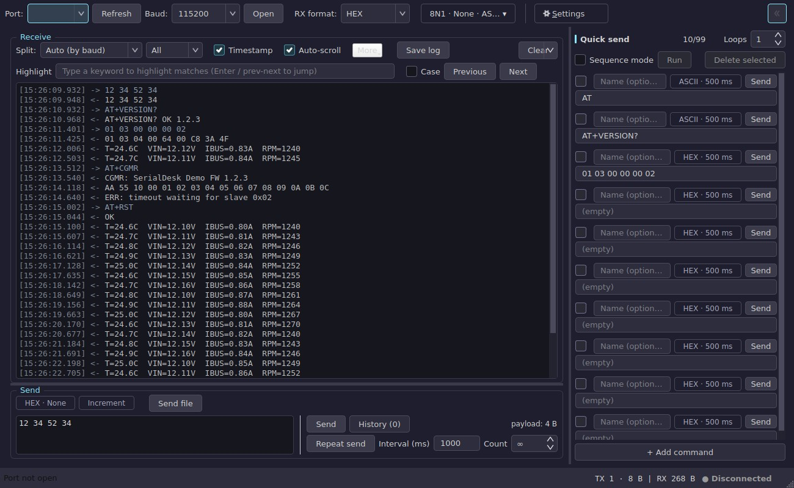
  <br>
  <sub>Main window · dark theme (I/O, timestamps, checksums, quick send; English UI shown)</sub>
</p>

<p align="center">
  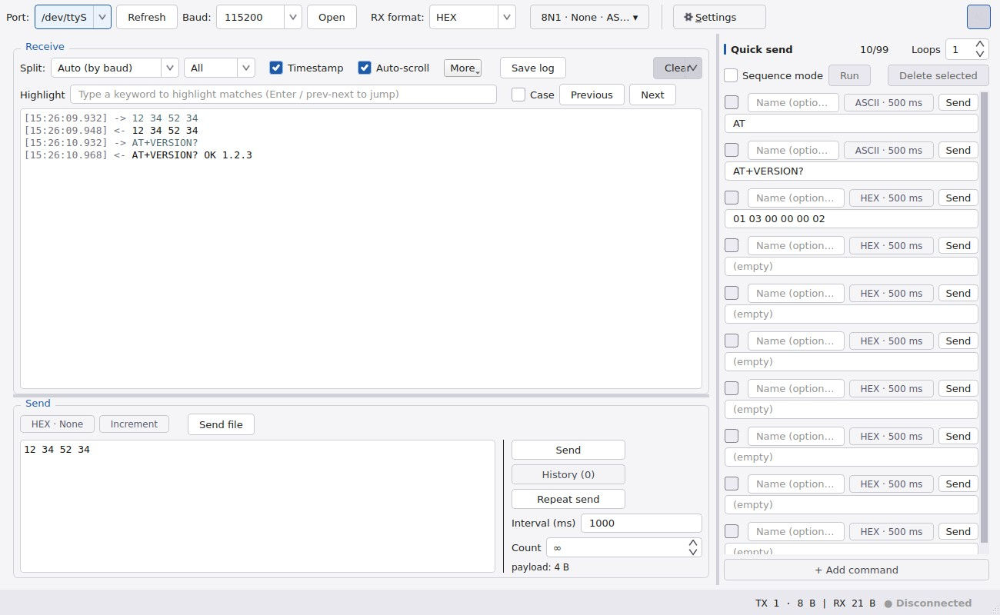
  <br>
  <sub>Main window · light theme (the theme can follow the system)</sub>
</p>

<p align="center">
  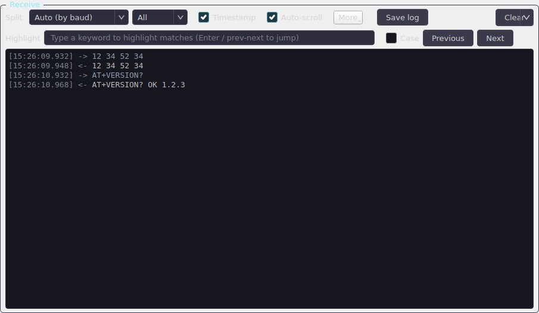
  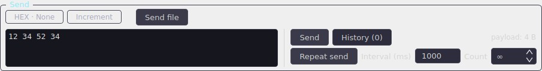
  <br>
  <sub>Receive area (keyword highlight · view filter · timestamps) · Send area (input left, send + repeat right)</sub>
</p>

<p align="center">
  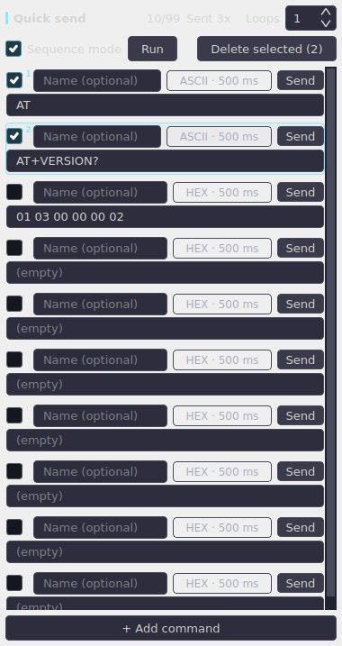
  <br>
  <sub>Quick-send panel: sequence mode · sent counter · the row being sent</sub>
</p>

<p align="center">
  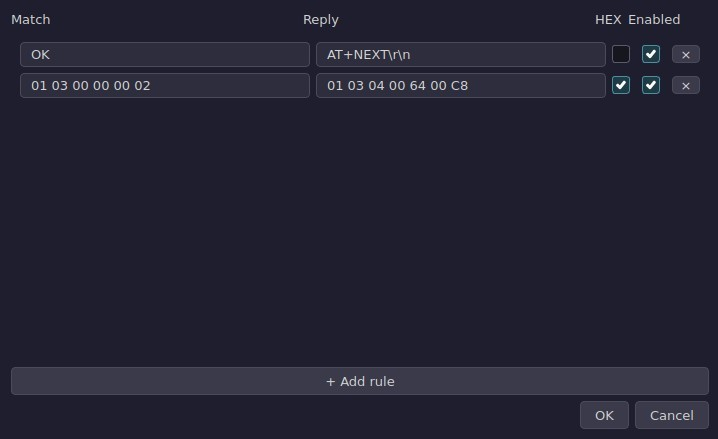
  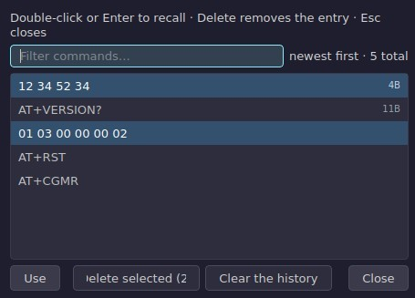
  <br>
  <sub>Auto-reply rules · Send history (format / size per entry)</sub>
</p>

<p align="center">
  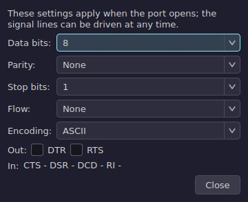
  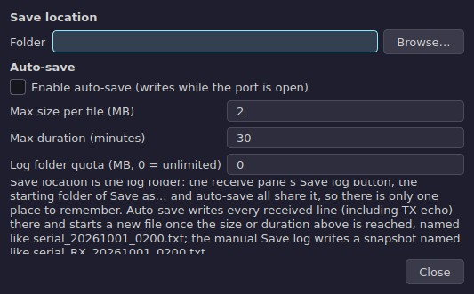
  <br>
  <sub>Port settings (data bits / stop bits / parity / flow control) · Log saving settings</sub>
</p>

<p align="center">
  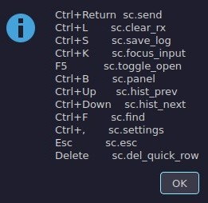
  <br>
  <sub>Shortcut reference</sub>
</p>

### Progress

- **Released**: 83 version tags (latest **v1.9.4**), 175 commits, 186 automated tests green
- **Done**: the full serial I/O path (HEX/ASCII, framing, timestamps, checksums, logging, send history, auto-reply, auto-reconnect), quick send (sequences, repeat, `{i}` auto-increment, named commands with notes), receive enhancements (keyword highlight, view filter, column HEX, copy semantics), Chinese + English UI with dark/light themes, and the Windows installer and portable zip
- **To do**: 33 items (protocol decoding layer, waveform view, toolbox, multi-port, terminal mode and more - the full list lives in the development task document)

**Next development task (only this one)**: declarative protocol decoding (B4-P1) - script-free field parsing: frame headers / field lengths / data types (incl. float and endianness) / checksum rules, with built-in Modbus RTU, AT and NMEA templates; the pure parsing core first, with unit tests, then the field panel.

### Roadmap

| Version | Content | Status |
|---------|---------|--------|
| v0.1.0 | Core TX/RX + HEX/ASCII + CRC16 | ✅ Done |
| v0.2.0 | Format dropdowns / splitting / ms timestamps / checksums / quick send / themes | ✅ Done |
| v0.2.1 ~ v0.2.13 | UI fixes, icons, versioning, Releases via tags (onedir + zip), theme consistency, 10 default rows, baud box affordance, bilingual README | ✅ Done |
| v0.3.0 | Full serial parameters (data/parity/stop/flow), repeat send, append CRLF, log to file, send history | ✅ Done |
| v0.4.0 | File transfer, encodings (UTF-8/GBK), escape parsing, DTR/RTS control, auto-reply rules | ✅ Done |
| v0.5.0 | Usability batch (shortcuts / find / about / auto-scroll / undoable clear), command sequences, config import-export, auto-reconnect | ✅ Done |
| v0.6.0 ~ v0.9.0 | Single-file Windows installer + trimmed bundle, send-history dialog, regrouped receive bar, measured layout floors | ✅ Done |
| v0.10.0 ~ v0.14.0 | History dialog upgrade (count row / filter / metadata / remembered size), receive-area simplifications, one log-settings dialog, two send-area rebuilds, localised connection bar, no more clipped rows when dragging dividers | ✅ Done |
| **v1.0.0** | **First stable release**: the feature set is closed - serial I/O, HEX, framing, timestamps, checksums, quick send, command sequences, file transfer, auto-reply, auto-reconnect, logging, Chinese + English UI, installer - and the project moves into long-term maintenance | ✅ This release |
| **v1.1.0** | Quick-send panel rework (two-line rows, two-way fold with a labelled rail), unified send counter, visible delay unit, and a fix for folding wiping the settings | ✅ This release |
| **v1.2.0** | Send-area and quick-send design pass: data-first heights, a line-ending picker, a real settings control, a selection that expires, and row detail fixes | ✅ This release |
| **v1.3.0** | Quick-send and send area: one-line rows with a property chip, multi-select delete, an options chip, an input box that owns the pane's spare height, and a fold that costs no width | ✅ This release |
| **v1.4.0** | Quality pass: focus rings and accessible names, diagnostics plus a crash log, one monospace counter, a shortcut reference, and a CI test gate | ✅ This release |
| **v1.5.0** | A quiet startup update check (disable-able, fails silently, sends nothing about this machine) with a status-bar note and a Settings link to the download page | ✅ This release |
| **v1.6.0 ~ v1.6.3** | UI batches A-D: centred icons and double chevrons, a four-way RX/TX filter, a receive-row re-plan, panel titles, the clear split button, send-box wrapping, full device names in the port dropdown | ✅ Done |
| **v1.7.0** | Sequence loop count and repeat-send count, closing out UI batches A-D (regenerated icons, row re-plan, filter fixes) | ✅ Done |
| **v1.8.0** | `{i}` auto-increment in the send box, a persistent receive keyword highlight bar, named quick-send commands with notes (two-line rows, lossless migration) | ✅ Done |
| **v1.8.1** | Fixes and polish: live highlighting for newly received rows, a "sent N times" sequence counter plus a highlight on the row being sent, the duplicate fold control removed, and larger spin-box / clear-dropdown arrows | ✅ Done |
| **v1.8.2** | Send area labelled by its sections (send content / repeat send / send·history), ticking a row now arms "Delete selected", and the fold toggle moved to the far right of the connection row | ✅ Done |
| **v1.8.3** | Send area re-planned: payload box on the left, Send / History / repeat controls in a column on the right (the primary button under the hand); pane minimum height 335→235 px | ✅ Done |
| **v1.8.4** | Send area is two bands again: settings row on top, then one row split left / right (input box | compact Send / History / repeat column, flush with the box) | ✅ Done |
| **v1.8.5** | Send pane squeezed to about two button rows with smaller side-by-side buttons, the input wraps + scrolls by default, and the data area gets more height by default | ✅ Done |
| **v1.8.6** | Fix: the send-history list follows the app theme (it rendered light off-Windows); README gallery rebuilt (content-dense shots, full-width overviews, 10 shots per language) | ✅ Done |
| **v1.8.7** | Send history takes multi-select (Ctrl/Shift) and Ctrl+A with batch delete; README reworked (download section per release asset, categorised feature tables with a `{i}` example, progress block) | ✅ Done |
| **v1.8.8** | Wrapping needs no setting any more (send box and receive pane always wrap; both switches removed); the receive Clear split button became one plain button that clears the display and the counters together (its dropdown and the duplicate Settings entry are gone) | ✅ Done |
| **v1.8.9** | Three send-area refinements: quick-send ASCII rows follow the line ending; quick-send rows select and delete in any mode (the button reads "Delete"); in HEX mode the line-ending / escape controls stay visible but off, with the reason in the tooltip | ✅ Done |
| **v1.9.0** | Data-path correctness and speed (the ASCII view keeps \t \n \r, one row model for pane and store, no busy-sleep in the read loop, coalesced counters, batched log writes - 1 Mbps batch p95 67.65 -> 2.27 ms) + four quick-send refinements (sequence rounds, click-to-select delete, quieter dark selection, icon-only Settings) + four send-area refinements (action column 411 -> 200 px, payload box 364 -> 575 px, outlined secondary buttons, escapes and send-file folded into the send-settings chip, receive More button matched to the row) | ✅ Done |
| **v1.9.1** | The UI review L1 batch (24 px pointer-target floor, CONNECTING and open-failure states, accessible names on the dynamic rows, control heights down to 24/28/32) plus internal process improvements | ✅ Done |
| **v1.9.2** | The installer lets you choose the install folder (Inno hid the destination page by default) and the default log folder; the log folder resolves portable -> config -> installer choice -> default, with an unwritable fallback | ✅ Done |
| **v1.9.3** | Quick-send selection model fixed: the row tick shows only in sequence mode (and there a tick selects, so a ticked row can be deleted); outside the mode the click highlight selects (Ctrl/Shift for several); a disabled Delete explains itself in its tooltip | ✅ Done |
| **v1.9.4** | The delete action is diagnosable: pressing Delete with nothing armed now says "nothing selected"; it also honours what was armed when the button went down, so a press that drops the highlight cannot silently do nothing | ✅ This release |
| **Next** | **Declarative protocol decoding (B4-P1)**: script-free field parsing (frame header / field types / checksum + Modbus RTU / AT / NMEA templates) | 🚧 Next up |

### Quick start

Run from source:

```bash
git clone https://github.com/QuAndy2016/SerialDesk.git
cd serialdesk
python3 -m venv .venv
source .venv/bin/activate        # Windows: .venv\Scripts\activate
pip install -r requirements.txt
python main.py
```

Run tests:

```bash
pytest tests/ -v
```

### Directory structure

```
main.py                  # entry point
app/protocol.py          # HEX/ASCII, CRC16/CRC32/SUM8 checksums, Modbus frames
app/serial_worker.py     # serial QThread: all port I/O lives here
app/framing.py           # frame assembly: merges USB-fragmented chunks
app/config.py            # settings persistence (config.json)
ui/main_window.py        # main window
ui/quick_send_panel.py   # quick send panel
ui/theme.py              # dark / light / follow-system themes
assets/                  # logo, donation QR, arrow icons
tests/                   # unit tests
```

### Acknowledgements

This project stands on the shoulders of the open-source community:

- **PySide6 / Qt** - cross-platform UI framework
- **pySerial** - the serial communication layer
- **PyInstaller** - Windows packaging

And thanks to everyone who shares serial-debugging experience, interface design guidelines and lessons learned openly on the internet: those public guides, docs and discussions shaped how this tool behaves.

### Contributing

Issues, PRs and stars are all welcome. If a serial debugging pain point is missing here, open an issue and describe your workflow.

### Support

This tool was built line by line, late at night. No ads, no pop-ups, no "free core, paid extras" playbook — the code stays open, and it stays yours.

If it has ever saved you an afternoon of debugging, you are welcome to buy the author a coffee. It changes nothing for you, and it is what keeps this project moving. Donations are entirely optional — the tool keeps getting updates either way.

The donation QR code in the Chinese section is a personal WeChat Pay code, which only works inside mainland China; this project does not run an overseas donation channel. If the tool is useful to you, a star, an issue, or a share with a colleague who debugs serial ports means just as much.

### License

MIT — see [LICENSE](LICENSE).

</details>
