<p align="center">
  
</p>

# SerialDesk

**串口台 —— 让串口调试回归它本该有的样子：插上、打开、收发、存档，不折腾。**

***SerialDesk (串口台) — serial debugging the way it should be: plug in, open, send, receive, done. A clean, capable, cross-platform serial debugging tool that keeps growing.***

基于 **PySide6 + PySerial**，面向嵌入式 / 电机控制 / 工业控制工程师。

*Built on **PySide6 + PySerial**, for embedded, motor-control and industrial-control engineers.*

**下载 / Download:** [Windows x64 安装包 · installer](https://github.com/QuAndy2016/SerialDesk/releases/latest) · [便携 zip · portable zip](https://github.com/QuAndy2016/SerialDesk/releases/latest) · [源代码 · source](https://github.com/QuAndy2016/SerialDesk)

**Language:** 中文（本页）· [English](#english-version) — the full English README is the collapsible block at the bottom.

---

## What is it (English)

A cross-platform serial debugging tool for embedded, motor-control and industrial-control engineers, built on **PySide6 + PySerial**: HEX and ASCII views, framing, timestamps, CRC16 / CRC32 / SUM8, quick command banks, command sequences, file transfer, receive logs that save themselves, and a UI in Chinese and English — shipped as a single-file Windows installer or a portable zip.

**Download:** [Windows x64 · installer](https://github.com/QuAndy2016/SerialDesk/releases/latest) — no Python needed. The exe is unsigned, so Windows may warn on first run; the three-step fix is in ***Download for Windows*** below.

**Full English README** → [click here](#english-version) (or scroll to the bottom of this page).

### Interface tour

**Main window** — send and receive in one view, with timestamps and TX/RX counters.

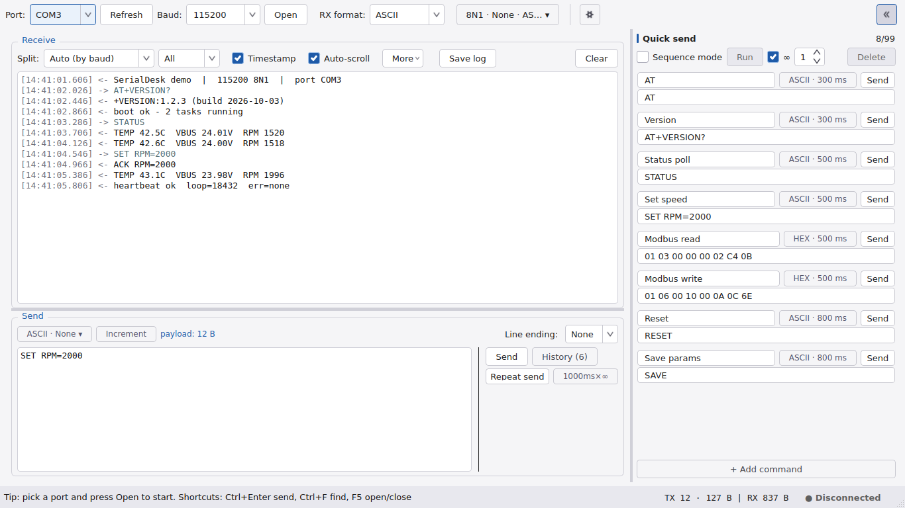

**Quick commands** — saved commands as a sequence, with an endless (∞) loop.

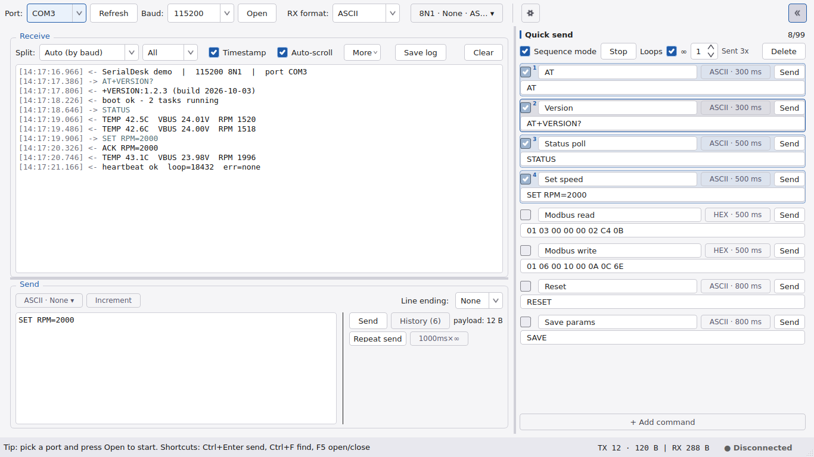

**Send settings** — escape parsing and file sending live in one compact popup.

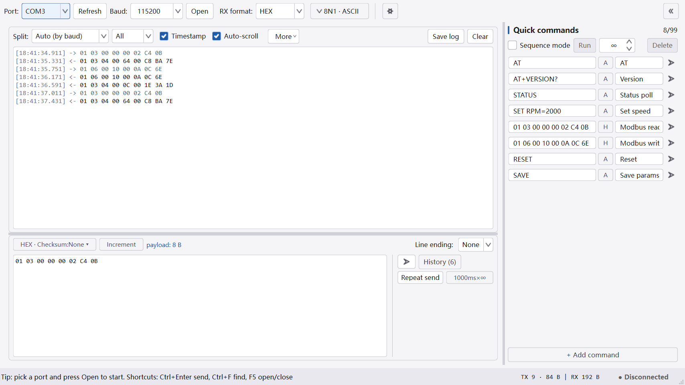

**HEX mode** — hex send and receive, here with a CRC16-Modbus checksum.

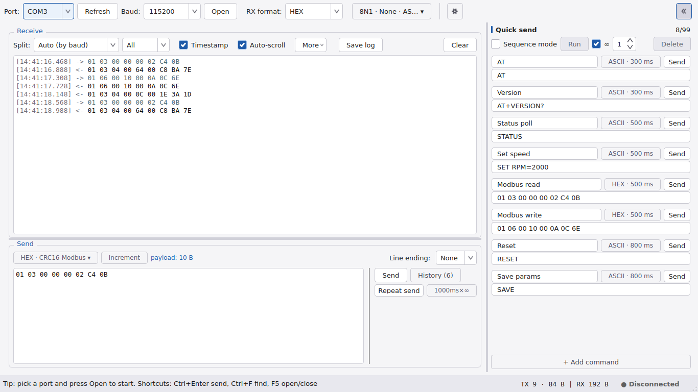

**Encoding** — GBK / UTF-8 (and more) for the receive pane, set in the port dialog.

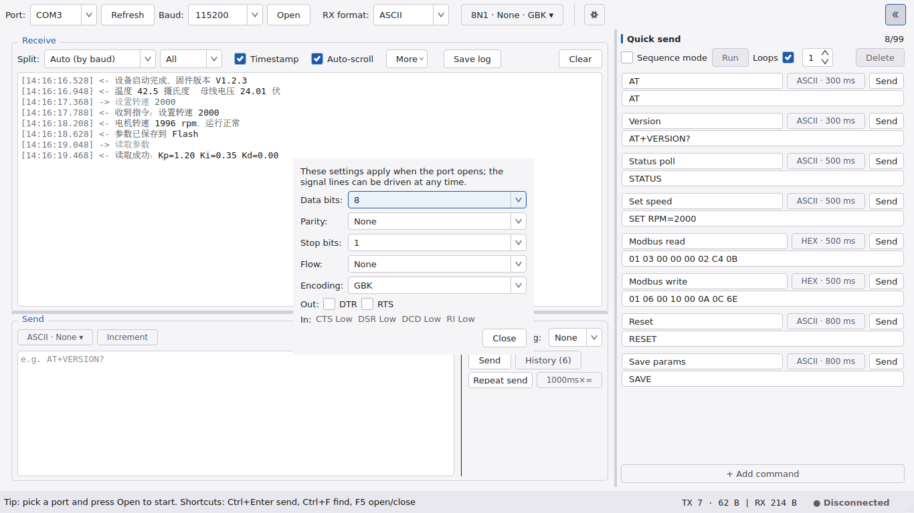

**Timestamps and display options** — per-line time, auto-scroll and the view filter.

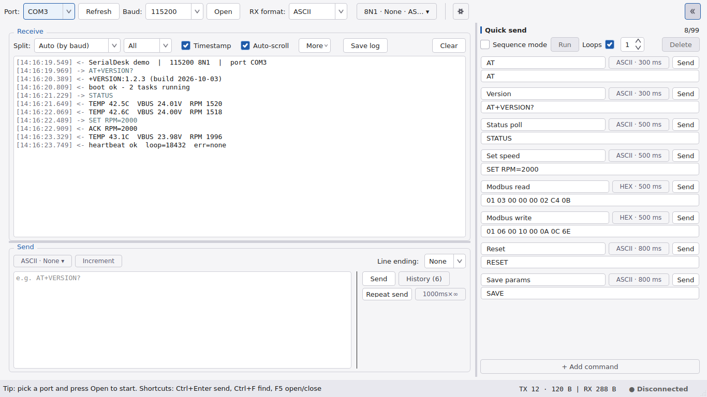

**Find** — a search bar that highlights every match live.

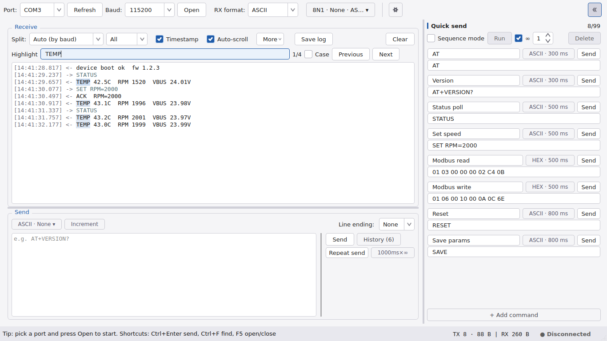

**Statistics** — session TX/RX counters plus a rolling throughput read-out.

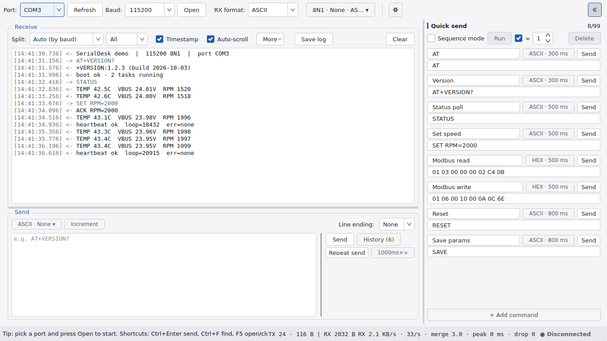

**Send history** — recall a past command in one click, with format and size metadata.

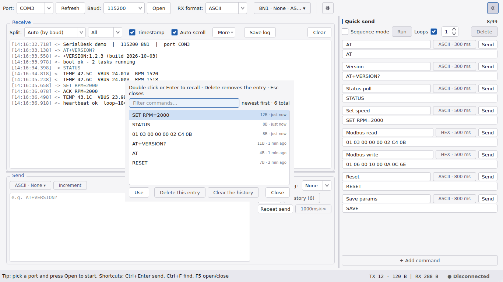

**Dark theme** — the same workspace, easy on the eyes at night.

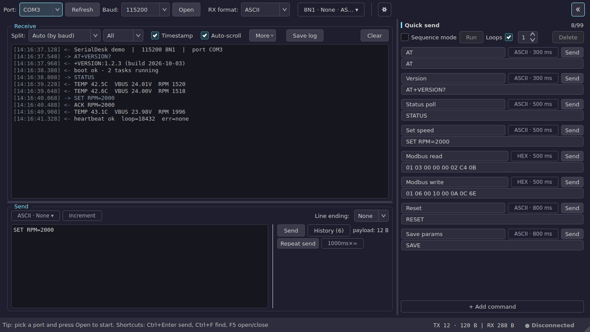

**Close-ups** (the parts a full-window shot cannot show)

**One quick-command row** — the command owns the left, the format marker and name sit on the right, and the paper plane sends on a single click.


**Find bar** — a separator from the control row above, a fixed-width slot for the match counter (so the buttons never jump when the number appears), up/down arrows and the close button closing the cluster.


**Receive control row** — view filter, timestamps, auto-scroll, More, save log and clear, packed tight.


**Status bar** — looking back pauses following temporarily and says so ("Following paused - return to the bottom of the pane"); the tick and your config stay untouched.


**Framing parameters** — length-prefixed frames here: prefix size, endianness and the optional CRC-16/Modbus check that drops a bad frame and resynchronises.


**Send settings** — escape parsing and file sending live in one compact popup instead of taking space in the main window.


---

## 这是什么

串口是嵌入式世界里最古老、也最可靠的接口。每一次点亮一块新板子、每一条 Modbus 报文、每一段固件升级日志，最后都要落在屏幕上一行行滚动的字节里。

但真正顺手的串口工具并不多：功能强的往往界面停留在上个十年，清爽的又缺了工程师每天都要用的那几个开关。这个项目想做的事很朴素 —— 界面现代、开箱即用、开源可改，把日常调试里最高频的能力一次做对。

它不追求功能堆叠，只想成为你调试时最不需要思考的那一个窗口。

### 核心特性

- **一帧一行，不被 USB 适配器拆散**：分包支持 **自动（按波特率）/ 手动毫秒 / 按帧头**，以及不依赖时间的
  **定长 / 起止定界 / 长度前缀（可带 CRC-16 校验并自动重新同步）**。自动模式的下限按 **USB 转串口芯片的延迟
  定时器**（FTDI 默认 16 ms）取 **50 ms**——这是很多助手把一帧显示成两行的真正原因。
- **快捷指令面板**：一条命令一行、**纸飞机单击即发**、**序列模式支持 ∞ 无限循环**、每行可写名称与备注、
  多选删除带 **3 秒撤销**；`Ctrl+B` 折叠给接收区让位，**折叠后窗口最小宽度不到半屏**。
- **自动滚动"跟随但不粘人"**：往回看历史只**临时暂停跟随**，不会取消"自动滚动"勾选、也不会改配置；
  拖回最底部自动继续跟，状态栏有明确提示。
- **接收区**：查找（`Ctrl+F`，高亮 + 命中计数 + 上下一处）、**视图过滤（全部 / 只看接收 / 只看发送）**、
  **列式 HEX**、毫秒时间戳、**暂停显示（界面冻结但数据继续写日志，不丢字节）**。
- **发送侧**：HEX / ASCII、行尾 CR/LF/CRLF、转义解析、**CRC16-Modbus / CRC16-CCITT / CRC32 / SUM8**、
  **`{i}` 自动递增**（扫从机地址、测序列号）、循环发送、发送历史、发送文件。
- **日志与诊断**：接收日志自动保存（可设分片与总量配额）；**诊断信息一键复制**，其中包含**实测的 USB
  分片间隔（n / p95 / max）与当前分包窗口**——提 Issue 时贴上它，定位快得多。
- **双语与主题**：中文 / English 一键切换，深色 / 浅色 / 跟随系统；正文对比度 ≥ 4.5:1、
  点击目标 ≥ 24×24 px、键盘可走完主要流程。
- **开源免费**：MIT 许可，无广告、无弹窗、无"基础免费高级收费"。

### 界面截图

**主界面** —— 收发同屏，时间戳与 TX/RX 计数一目了然。

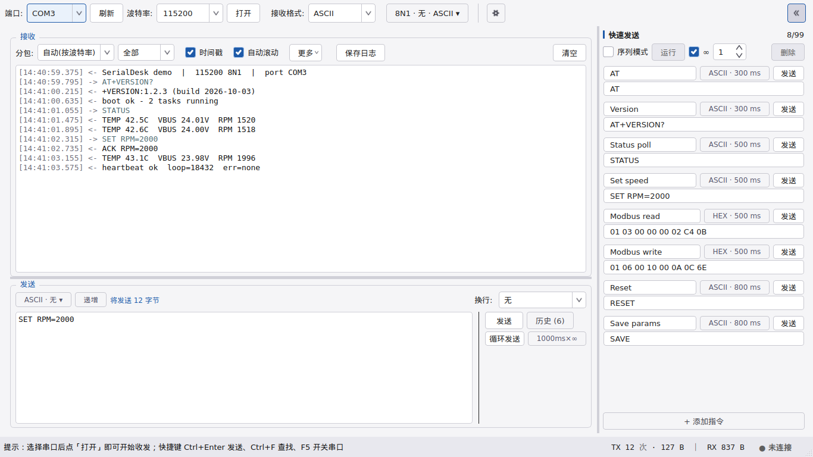

**快捷指令** —— 常用指令编成序列，支持 ∞ 不限次数循环。

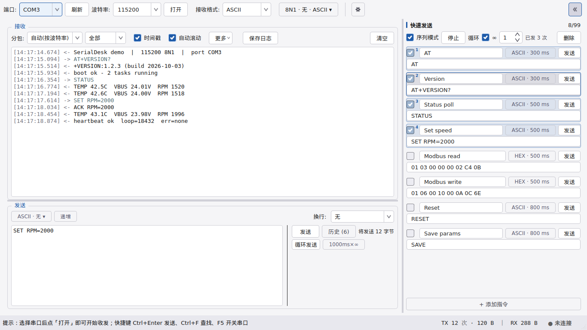

**发送设置** —— 转义解析与发送文件收在一个紧凑的下拉里。

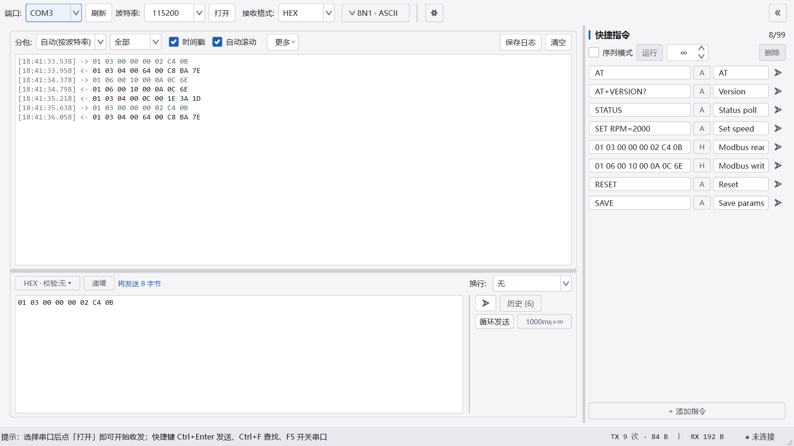

**HEX 模式** —— 十六进制收发，这里带 CRC16-Modbus 校验。

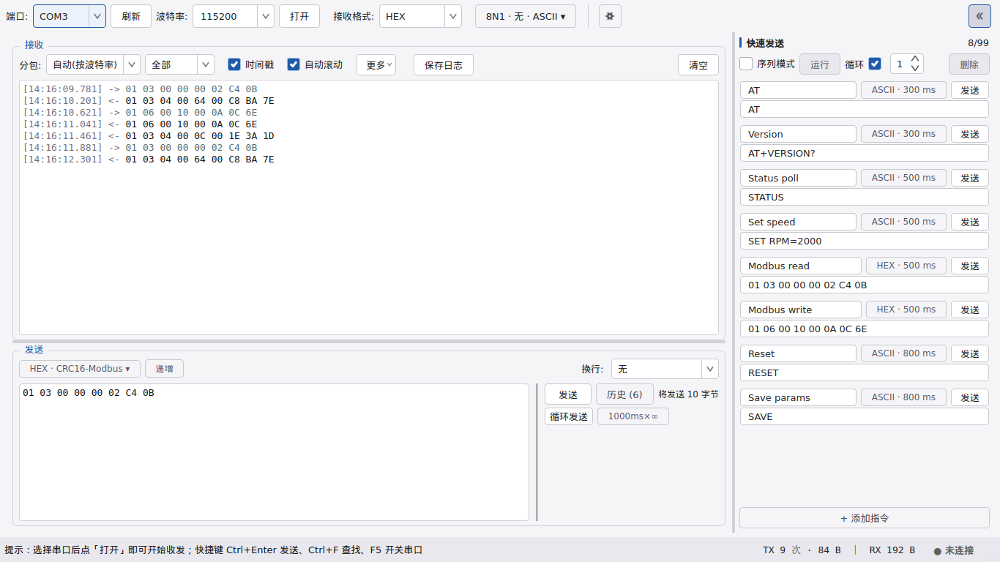

**多编码** —— 接收区支持 GBK / UTF-8 等编码，在串口参数对话框中设置。

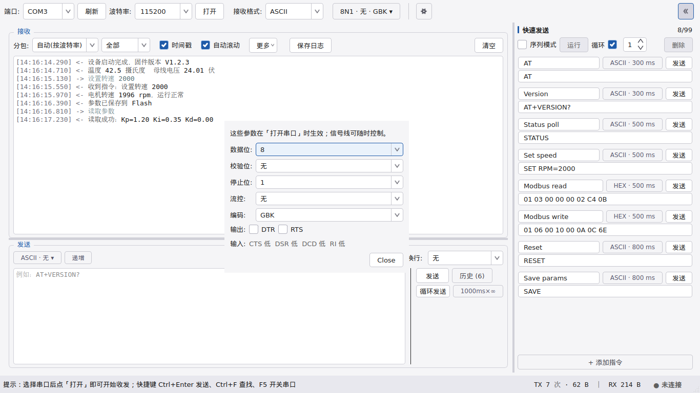

**时间戳与显示选项** —— 逐行时间、自动滚动与视图过滤。

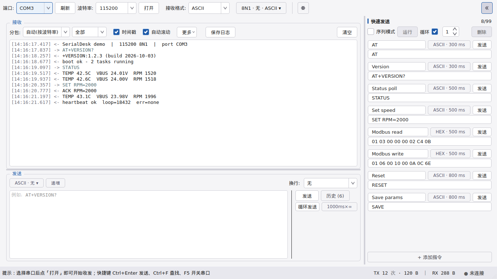

**查找** —— 搜索栏实时高亮每一处匹配。

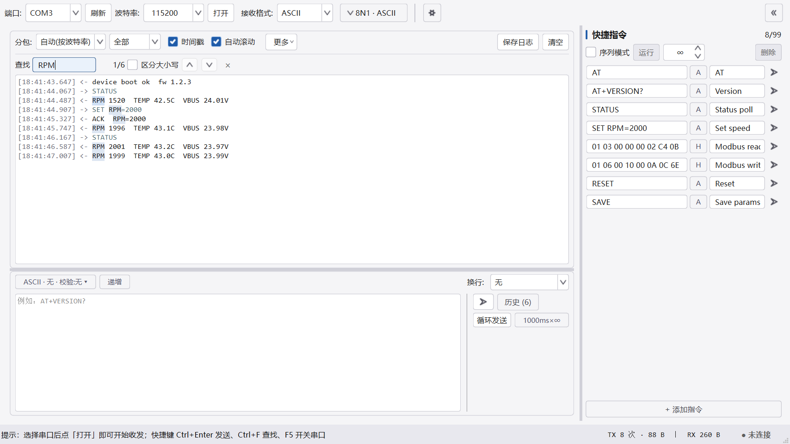

**数据统计** —— 会话收发计数与实时吞吐读数。

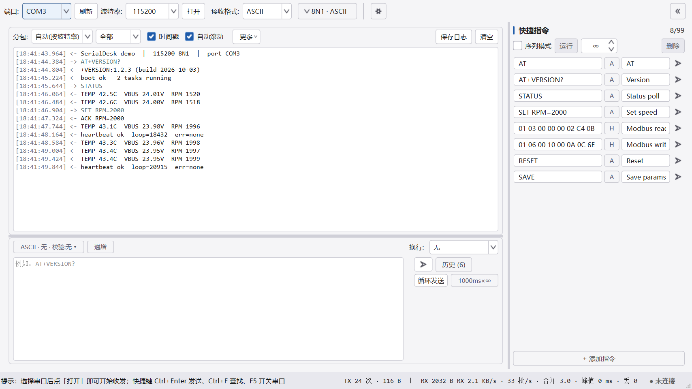

**发送历史** —— 一键回填历史指令，附格式与字节数。

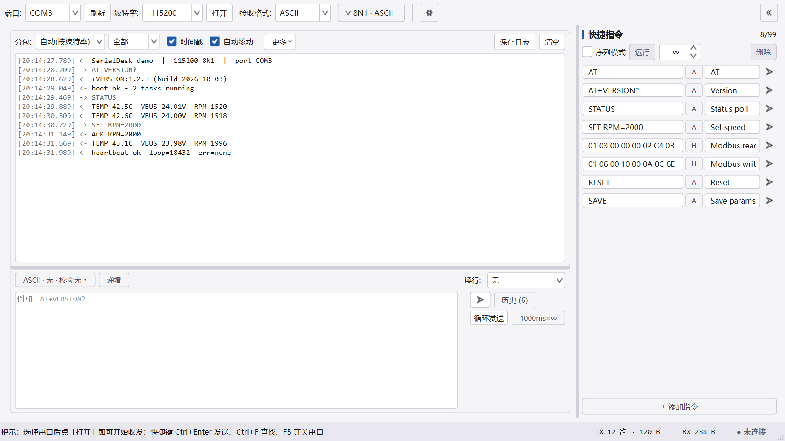

**深色主题** —— 同样的工作区，夜间更护眼。

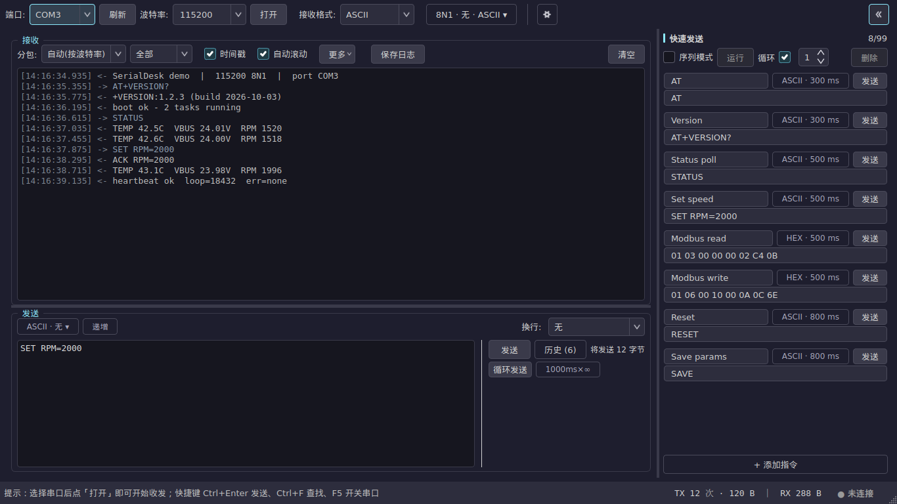

**细节特写**（整窗图看不清的地方，这里放大看）

**快捷指令的一行** —— 命令在左、格式标记与名称在右、最右一个纸飞机：单击即发。


**查找栏** —— 与上方控件行之间有分隔线；命中计数占固定槽位（数字出现时按钮不会跳），上/下一处是箭头，关闭键跟在簇尾。


**接收区控件行** —— 视图过滤、时间戳、自动滚动、更多、保存日志、清空各就各位，间距收得很紧。


**状态栏** —— 往回看历史时只临时暂停跟随，这里会写明「已暂停跟随 · 拖回接收区底部继续」，而勾选与配置都不动。


**分包参数** —— 以「长度前缀」为例：前缀字节数、大小端、可选的 CRC-16/Modbus 校验（校验失败自动丢帧并重新同步）。


**发送设置** —— 转义解析与发送文件收在一个紧凑弹层里，不占主界面空间。

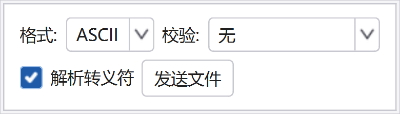

## 下载与安装（Windows 64 位，无需 Python）

到 [Releases 页面](https://github.com/QuAndy2016/SerialDesk/releases/latest) 下载。每个版本带 4 个文件：

| 文件 | 说明 |
|------|------|
| `SerialDesk_vX.Y.Z-win64-setup.exe` | **安装版**（约 24 MB）：双击安装，自动创建开始菜单项与卸载入口，可选创建桌面快捷方式；**安装时可自选安装目录与日志默认目录**；装完可直接勾选运行 |
| `SerialDesk_vX.Y.Z-win64.zip` | **免安装版**（约 34 MB）：解压即用，整个目录一起拷贝即可带走，适合 U 盘 / 绿色部署 |
| `SerialDesk_vX.Y.Z-win64-setup.exe.sha256` | 安装版的 SHA256 校验文件 |
| `SerialDesk_vX.Y.Z-win64.zip.sha256` | 免安装版的 SHA256 校验文件 |

**怎么选**：想装进系统、要开始菜单和卸载项 → 安装版（setup.exe）；想绿色便携、不想动系统 → 免安装版（zip）。

两种方式共同点与注意：
- 都是 64 位 Windows 程序，已内置 Python 运行时，**不需要另装 Python**
- zip 版请**解压整个目录再运行**，不要把 exe 单独拷出来（同目录的文件夹是运行库）
- **便携模式**：在 exe 同目录放一个空的 `portable.txt`，配置与日志就写在程序目录；否则写在 `%APPDATA%\SerialDesk`
- **校验下载**：`certutil -hashfile SerialDesk_vX.Y.Z-win64.zip SHA256`，与对应 `.sha256` 文件里的值比对

## 功能

### 连接与串口参数

| 功能 | 说明 |
|------|------|
| 串口枚举自动刷新 | 3 秒轮询，插拔自动感知；下拉显示完整设备名（COM5 — USB-SERIAL CH340） |
| 波特率 | 26 档预设（110 ~ 3000000），支持自定义输入（非法值即时红框提示） |
| 完整串口参数 | 数据位 5~8 / 停止位 1·1.5·2 / 校验 无·奇·偶·Mark·Space / 流控 无·软件·硬件（打开端口时生效） |
| DTR/RTS 控制 + 信号线监视 | 控制 DTR/RTS 输出，实时显示 CTS/DSR/DCD/RI（50 ms 刷新） |
| 断线自动重连 | 端口异常断开后自动尝试恢复 |
| 界面语言 / 主题 | 中文·English·跟随系统；深色·浅色·跟随系统，均持久化 |

### 收发与显示

| 功能 | 说明 |
|------|------|
| 接收格式 | ASCII / HEX / HEX+ASCII 双显示 / 列式 HEX（16 字节一行 + 偏移 + ASCII 对照） |
| 分包模式 | 不分包 / 自动按波特率（3.5 字符法则）/ 手动 ms / 按帧头 / 定长 / 起止定界 / 长度前缀 |
| 时间戳前缀 | 不显示 / HH:MM:SS / HH:MM:SS.mmm / 完整日期毫秒 |
| 收发同屏 | 发送内容回显到接收区：TX 行 `->`、RX 行 `<-`，等宽标记不打乱 HEX 对齐，可一键关闭 |
| 视图过滤 | 全部 / 只看接收 / 只看发送（过滤在片断层生效，标记不串行） |
| 关键词高亮 | 常驻高亮条：输入即高亮、不抢滚动位置，大小写可选；新到的数据同样即时高亮 |
| 多编码 | 接收与发送支持 ASCII / UTF-8 / GBK / GB2312，中文报文不再乱码 |
| 转义解析开关 | `\r \n \t \xNN` 可解析为控制字符，也可按字面原样发送（入口在发送行的「发送设置」下拉按钮里） |
| 状态栏 | 收发字节计数（等宽）+ 端口与波特率 + 连接状态灯；接收吞吐仪表：1 秒滚动窗口显示速率 / 批每秒 / 每批合并片段数 / 单批最坏耗时 / 丢帧计数 |

### 发送与快捷发送

| 功能 | 说明 |
|------|------|
| 校验追加套件 | CRC16-Modbus / CRC16-CCITT / CRC32 / SUM8 |
| 追加 `\r\n` | ASCII 模式下发送自动追加回车换行（AT 指令常用）；**快捷指令行的 ASCII 行同样追加**；HEX 模式下选择器可见但禁用（按字节原样发送，需要行尾自己写 `0D 0A`） |
| 定时循环发送 | 点一下开始、再点一下停止（运行中按钮显示「停止循环」），10~60000 ms 间隔；间隔与次数收在旁边的下拉按钮里 |
| 重复发送次数 | 循环可设次数（1–9999）；勾选「∞ 不限」则一直循环，直到手动停止 |
| 快捷指令面板 | 默认 10 条、最多 99 条指令，config.json 持久化，重启不丢；勾选行或单击行即选中，点「删除」即可删除（3 秒内可撤销） |
| 命令名称 + 备注 | 每条可填名称与备注（行内两行显示，右键编辑备注），旧配置无损迁移 |
| 发送内容自动递增 | `{i}` 占位符在发送前替换为递增计数，详见下方示例 |
| 指令序列 | 序列模式：每条指令自带延迟，点「运行」按序自动发出（上电时序、AT 初始化）；头部显示「已发 N 次」，正在发送的那一行高亮 |
| 发送历史 | 最近 50 条自动记录、去重、持久化；弹窗可筛选，每条带格式/字节数/时间；**支持多选（Ctrl/Shift）与 Ctrl+A 全选后批量删除**；双击或回车回填；清空需二次确认 |
| 发送文件 | 文本 / HEX / 二进制按 4 KB 分块发送，带进度条与预计耗时，可中途取消（入口在「发送设置」下拉按钮里，发送中行内显示「取消发送」） |

#### 示例：发送内容自动递增 `{i}`

占位符写在发送内容里，发送前会根据「递增」面板的设置（起始值 / 步长 / 位宽 / 字节序 / 进制 / 回绕）替换成具体数值；发送历史只记录模板。

| 占位符 | 含义 |
|--------|------|
| `{i}` | 按设置位宽输出十进制计数 |
| `{i:N}` | 指定位宽 N（不足前补 0），如 `{i:4}` → 0001 |
| `{i:N:le}` | 位宽 N + 小端字节序（HEX 模式常用） |
| `\{i}` | 转义，输出字面量 `{i}`，不递增 |

| 模板（HEX） | 设置 | 第 1 次发出 | 第 2 次发出 |
|-------------|------|-----------|-----------|
| `AA 55 {i:2} 0D` | 起始 1 / 步长 1 / 位宽 2 / 大端 | `AA 55 00 01 0D` | `AA 55 00 02 0D` |
| `01 10 {i:2:le} 00 02` | 起始 1 / 位宽 2 / 小端 | `01 10 01 00 00 02` | `01 10 02 00 00 02` |

到上限时：勾选「回绕」则回到起始值继续，不勾则自动停止循环/序列并提示。

### 日志、自动化与配置

| 功能 | 说明 |
|------|------|
| 接收日志保存 | 一键保存到日志目录（状态栏给出路径）、另存为…；自动保存开关、单文件上限、时长、日志目录统一在「设置 → 日志保存设置…」 |
| 自动应答规则 | 收到指定匹配串自动回复指定内容，规则可增删改并持久化（HEX 模式可选） |
| 配置导入导出 | 快捷指令列表、主题、语言、发送历史、自动应答规则打包成一个 JSON，换机器导入即恢复 |

### 工程与打包

| 功能 | 说明 |
|------|------|
| 背景 QThread 读取 | 串口 I/O 在后台线程，UI 永不卡顿 |
| 正式图标 | 窗口 / 任务栏 / EXE 文件图标 |
| 打包 | 安装版（setup.exe）与免安装 zip，均内置 Python 运行时 |

## 当前版本

**v1.10.0**（2026-10-04 发布）· 187 条自动化测试全绿

当前功能：串口收发全链路（HEX/ASCII、分包、时间戳、校验、日志、发送历史、自动应答、断线重连）、快速发送（序列 / 循环 / `{i}` 递增 / 命名备注）、接收增强（关键词高亮、视图过滤、列式 HEX、复制语义）、中英双语 + 深浅主题、Windows 安装器与免安装包。

**下一项**：声明式协议解析（B4-P1）—— 免脚本的字段化解析：帧头 / 字段长度 / 数据类型（含 float、大小端）/ 校验规则，内置 Modbus RTU、AT、NMEA 模板。

## 快速开始

从源码运行：

```bash
git clone https://github.com/QuAndy2016/SerialDesk.git
cd serialdesk
python3 -m venv .venv
source .venv/bin/activate        # Windows: .venv\Scripts\activate
pip install -r requirements.txt
python main.py
```

运行测试：

```bash
pytest tests/ -v
```

## 目录结构

```
main.py                  # entry point
app/protocol.py          # HEX/ASCII, CRC16/CRC32/SUM8 checksums, Modbus frames
app/serial_worker.py     # serial QThread (timestamped receive)
app/framing.py           # frame assembly: merges USB-fragmented chunks
app/config.py            # settings persistence (config.json)
ui/main_window.py        # main window
ui/quick_send_panel.py   # quick send panel
ui/theme.py              # dark / light / follow-system themes
assets/                  # logo, donation QR, arrow icons
tests/                   # unit tests
```

## 致谢

这个项目站在开源社区的肩膀上：

- **PySide6 / Qt** —— 跨平台界面框架
- **pySerial** —— 串口通信底座
- **PyInstaller** —— Windows 打包

也要感谢互联网上公开分享串口调试经验、界面设计规范与踩坑记录的人：这些公开的指南、文档与讨论，塑造了这个工具的功能取舍与交互细节。

## 参与贡献

Issue、PR、Star 都欢迎 —— 如果你觉得这个工具有用，点一个 Star、提一个 Issue，或者转给同样在调串口的同事，就是最大的支持。有任何串口调试上的痛点，直接开 Issue 描述你的场景即可。

## 支持这个项目

这个串口助手是从第一行代码开始，一个个深夜攒出来的。它没有广告、没有弹窗、没有「基础功能免费、高级功能收费」的套路；代码永远开源，源码永远在你手里。

如果你用它省下过哪怕一个下午的调试时间，可以考虑请作者喝杯咖啡。一杯咖啡不影响你什么，却是我把它继续做下去的底气。打赏完全自愿 —— 不打赏也照样用，工具该更新还是会更新。

<p align="center">
  
  <br>
  <sub>微信扫码，随心就好</sub>
</p>

## 许可证

MIT — see [LICENSE](LICENSE).

---

<a id="english-version" name="english-version"></a>

<details>
<summary><b>🇬🇧 English version — click to expand</b></summary>

<br>

### Overview

Serial is the oldest and most reliable interface in embedded work. Every new board, every Modbus frame, every firmware log ends up as lines of bytes scrolling on a screen. Yet decent serial tools are rare: the powerful ones look like they were designed a decade ago, and the tidy ones are missing the switches engineers use every day.

This project aims for something simple — a modern interface, ready out of the box, open for you to change, with the daily essentials done right. It is not trying to pile on features; it just wants to be the window you never have to think about.

### Download and install (Windows 64-bit, no Python needed)

Grab them from the [Releases page](https://github.com/QuAndy2016/SerialDesk/releases/latest). Every version ships four files:

| File | What it is |
|------|------------|
| `SerialDesk_vX.Y.Z-win64-setup.exe` | **Installer** (~24 MB): double-click to install, creates a Start-menu entry and an uninstaller, optional desktop shortcut, **and you choose the install folder and the default log folder during setup**; can launch the app when it finishes |
| `SerialDesk_vX.Y.Z-win64.zip` | **Portable zip** (~34 MB): extract and run, copy the whole folder anywhere - handy on a USB stick or for a green deployment |
| `SerialDesk_vX.Y.Z-win64-setup.exe.sha256` | SHA256 checksum for the installer |
| `SerialDesk_vX.Y.Z-win64.zip.sha256` | SHA256 checksum for the portable zip |

**Which one**: want it in the system with a Start-menu entry and an uninstaller → the installer (setup.exe); want it self-contained and touching nothing else → the portable zip.

Both share the same notes:
- They are 64-bit Windows builds with the Python runtime bundled - **no Python installation needed**
- For the zip, **extract the whole folder and run it from there**; do not copy the exe out on its own (the sibling folder holds the runtime)
- **Portable mode**: drop an empty `portable.txt` next to the exe and the settings and logs stay in the program folder (otherwise they live in `%APPDATA%\SerialDesk`)
- **Verify the download**: `certutil -hashfile SerialDesk_vX.Y.Z-win64.zip SHA256` and compare it with the matching `.sha256` file

### Highlights

- **One frame, one line - even through a USB adapter**: framing offers **auto (by baud)**, a manual
  millisecond gap and split-by-header, plus timing-free modes: **fixed length**, **start/end
  delimiters** and **length-prefixed frames (optional CRC-16 with automatic resynchronisation)**.
  The auto rule is floored at **50 ms**, which is the USB bridge's own batching delay (an FTDI
  adapter's latency timer defaults to 16 ms) - the usual reason other tools show one frame as two lines.
- **Quick commands**: one command per line, **click the paper plane to send**, **sequence mode with an
  endless (∞) loop**, names and notes per row, multi-select delete with a **3-second undo**, and
  `Ctrl+B` to fold the panel - **folded, the window's minimum width is under half the screen**.
- **Auto-scroll that follows without sticking**: scrolling back **pauses following temporarily**, it
  never unticks the setting and never rewrites your config; return to the bottom and it follows
  again, with the state stated in the status bar.
- **Receive pane**: find (`Ctrl+F`, highlighting + match counter + previous/next), **view filters
  (all / RX only / TX only)**, **column HEX**, millisecond timestamps, and **pause display** (the
  view freezes while the log keeps every byte).
- **Sending**: HEX / ASCII, CR/LF/CRLF line endings, escape parsing, **CRC16-Modbus / CRC16-CCITT /
  CRC32 / SUM8**, **`{i}` auto-increment** (sweep slave addresses, step serial numbers), repeat send,
  send history and file sending.
- **Logs and diagnostics**: receive logs save themselves (with size/time rotation and a total quota);
  **one-click diagnostics** include the **measured USB chunk gaps (n / p95 / max) and the active
  framing window**, which makes a bug report land in one round.
- **Bilingual and themed**: Chinese / English, dark / light / follow system; text contrast ≥ 4.5:1,
  pointer targets ≥ 24x24 px, and the main workflows are keyboard-reachable.
- **Open source and free**: MIT licensed, no ads, no pop-ups, no "free core, paid extras".

### Features

#### Connection and serial parameters

| Feature | Notes |
|---------|-------|
| Auto-refreshing port list | 3s polling, hot-plug aware; the dropdown shows the full device name (COM5 — USB-SERIAL CH340) |
| Baud rates | 26 presets (110 ~ 3000000) plus editable custom input (invalid values get a red border) |
| Full serial parameters | data bits 5-8 / stop bits 1, 1.5, 2 / parity none-odd-even-mark-space / flow none, XON/XOFF, RTS/CTS (applied when the port opens) |
| DTR/RTS control + status lines | drive DTR/RTS and watch CTS/DSR/DCD/RI (refreshed every 50 ms) |
| Auto-reconnect | re-opens the port after an unexpected disconnect |
| Language / theme | Chinese·English·system; dark·light·system - both remembered |

#### Receive and display

| Feature | Notes |
|---------|-------|
| Receive format | ASCII / HEX / HEX+ASCII / column HEX (16 bytes a row with offset and ASCII gutter) |
| Frame splitting | off / auto by baud rate (3.5-char rule) / manual ms / by header / fixed length / start-stop delimiters / length prefix |
| Timestamp prefix | none / HH:MM:SS / HH:MM:SS.mmm / full date with milliseconds |
| TX echo | sent data mirrored into the pane: TX lines `->`, RX lines `<-`, equal-width markers keep HEX columns aligned, one click to turn off |
| View filter | all / RX only / TX only (filtering happens on the fragment level, markers never bleed into the wrong line) |
| Keyword highlight | an always-on bar: highlights as you type without stealing the scroll position, case switch, and rows that arrive later are highlighted too |
| Encodings | ASCII / UTF-8 / GBK / GB2312 for received and sent text |
| Escape parsing | `\r \n \t \xNN` interpreted as control characters, or sent literally (the switch lives inside the send-settings dropdown button) |
| Status bar | RX/TX byte counters (monospaced) + port and baud + a connection light; a rolling receive-throughput read-out (rate / batches per second / fragments merged per batch / worst batch cost / dropped) |

#### Sending and quick send

| Feature | Notes |
|---------|-------|
| Checksum append | CRC16-Modbus / CRC16-CCITT / CRC32 / SUM8 |
| Append `\r\n` | optional CRLF on send in ASCII mode (handy for AT commands); **quick command rows append it too**; in HEX mode the picker stays visible but off (bytes are exact - type `0D 0A` yourself) |
| Repeat send | click once to start, again to stop (the button reads Stop repeat); 10-60000 ms interval; interval and count sit in a dropdown beside it |
| Repeat count | optional limit (1-9999); tick ∞ to keep going until stopped by hand |
| Quick commands panel | 10 rows by default, up to 99 commands, persisted to config.json |
| Names and notes | every row can carry a name and a free-text note (two-line row, right-click to edit the note); old configs migrate losslessly |
| Auto-increment | the `{i}` placeholder becomes a running counter before sending - see the example below |
| Command sequence | sequence mode: each row has its own delay, press Run to fire them in order; the header shows a "sent N times" counter and the row being sent is highlighted |
| Send history | the last 50 commands, deduplicated and persisted; filterable popup with format / size / age per entry; **multi-select (Ctrl/Shift) or Ctrl+A with batch delete**; double-click or Enter recalls it; clearing asks twice |
| File send | text / HEX / binary files streamed in 4 KB chunks with a progress bar, ETA and cancel (the entry is in the send-settings dropdown button; while a transfer runs the row shows progress and Cancel) |

#### Example: the auto-increment placeholder `{i}`

The placeholder goes in the payload and is replaced just before sending according to the Increment panel (start / step / width / endianness / radix / wrap). History keeps the template only.

| Placeholder | Meaning |
|-------------|---------|
| `{i}` | decimal counter at the configured width |
| `{i:N}` | fixed width N, zero-padded (e.g. `{i:4}` → 0001) |
| `{i:N:le}` | width N, little-endian (common in HEX mode) |
| `\{i}` | escaped: sends a literal `{i}` and does not increment |

| Template (HEX) | Settings | 1st send | 2nd send |
|----------------|----------|----------|----------|
| `AA 55 {i:2} 0D` | start 1 / step 1 / width 2 / big-endian | `AA 55 00 01 0D` | `AA 55 00 02 0D` |
| `01 10 {i:2:le} 00 02` | start 1 / width 2 / little-endian | `01 10 01 00 00 02` | `01 10 02 00 00 02` |

At the limit: with Wrap on it restarts from the start value, with Wrap off it stops the repeat/sequence and says so.

#### Logging, automation and configuration

| Feature | Notes |
|---------|-------|
| Receive log to file | one-click save into the log folder (path in the status bar) and Save as…; the auto-save switch, size/duration limits and the folder live in Settings → Log saving settings… |
| Auto-reply rules | send a configured reply when a match string arrives; rules are editable, persisted and support HEX |
| Config import / export | quick command list, theme, language, send history and auto-reply rules in one JSON file |

#### Engineering and packaging

| Feature | Notes |
|---------|-------|
| Background QThread reading | all port I/O happens off the GUI thread - the UI never blocks |
| Proper icons | window, taskbar and EXE |
| Packaging | an installer (setup.exe) and a portable zip, both with the Python runtime bundled |

### Current release

**v1.10.0** (released 2026-10-04) · 187 automated tests green

Current feature set: the full serial I/O path (HEX/ASCII, framing, timestamps, checksums, logging, send history, auto-reply, auto-reconnect), quick send (sequences / repeat / `{i}` auto-increment / named commands with notes), receive enhancements (keyword highlight, view filter, column HEX, copy semantics), Chinese + English UI with dark/light themes, and the Windows installer and portable zip.

**Next up**: declarative protocol decoding (B4-P1) - script-free field parsing (frame header / field lengths / data types incl. float and endianness / checksum rules), with built-in Modbus RTU, AT and NMEA templates.

### Quick start

Run from source:

```bash
git clone https://github.com/QuAndy2016/SerialDesk.git
cd serialdesk
python3 -m venv .venv
source .venv/bin/activate        # Windows: .venv\Scripts\activate
pip install -r requirements.txt
python main.py
```

Run tests:

```bash
pytest tests/ -v
```

### Directory structure

```
main.py                  # entry point
app/protocol.py          # HEX/ASCII, CRC16/CRC32/SUM8 checksums, Modbus frames
app/serial_worker.py     # serial QThread: all port I/O lives here
app/framing.py           # frame assembly: merges USB-fragmented chunks
app/config.py            # settings persistence (config.json)
ui/main_window.py        # main window
ui/quick_send_panel.py   # quick send panel
ui/theme.py              # dark / light / follow-system themes
assets/                  # logo, donation QR, arrow icons
tests/                   # unit tests
```

### Acknowledgements

This project stands on the shoulders of the open-source community:

- **PySide6 / Qt** - cross-platform UI framework
- **pySerial** - the serial communication layer
- **PyInstaller** - Windows packaging

And thanks to everyone who shares serial-debugging experience, interface design guidelines and lessons learned openly on the internet: those public guides, docs and discussions shaped how this tool behaves.

### Contributing

Issues, PRs and stars are all welcome — a star, an issue, or a share with a colleague who debugs serial ports means just as much. If a serial debugging pain point is missing here, open an issue and describe your workflow.

### Support

This tool was built line by line, late at night. No ads, no pop-ups, no "free core, paid extras" playbook — the code stays open, and it stays yours.

If it has ever saved you an afternoon of debugging, you are welcome to buy the author a coffee. It changes nothing for you, and it is what keeps this project moving. Donations are entirely optional — the tool keeps getting updates either way.

### License

MIT — see [LICENSE](LICENSE).

</details>
