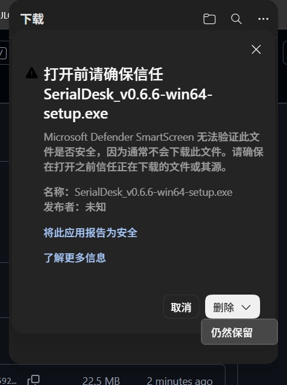
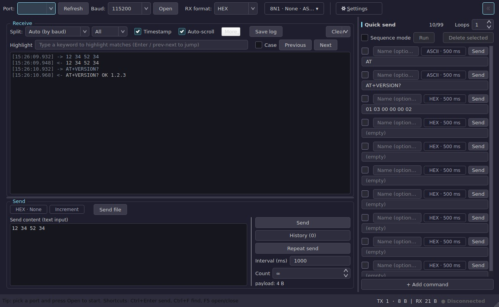
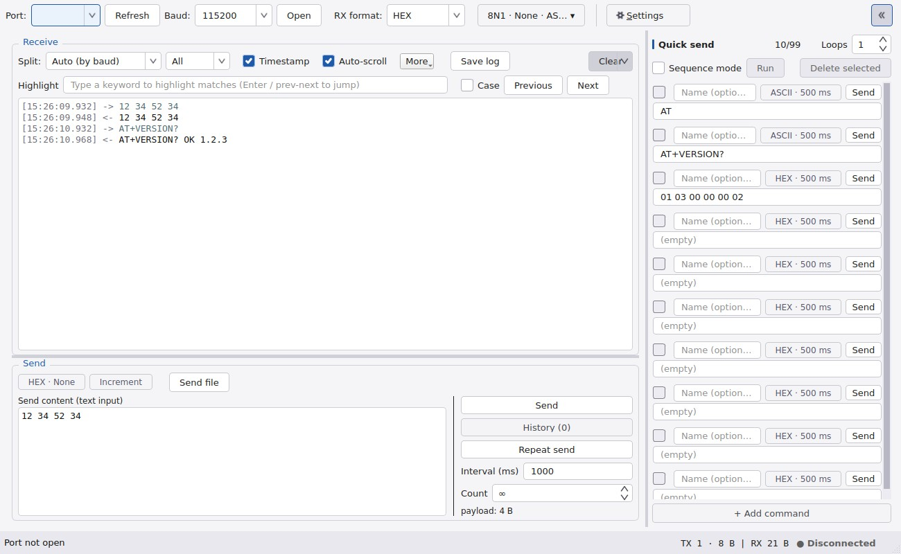

<p align="center">
  
</p>

# SerialDesk

**串口台 —— 让串口调试回归它本该有的样子：插上、打开、收发、存档，不折腾。**

***SerialDesk (串口台) — serial debugging the way it should be: plug in, open, send, receive, done. A clean, capable, cross-platform serial debugging tool that keeps growing.***

基于 **PySide6 + PySerial**，面向嵌入式 / 电机控制 / 工业控制工程师。

*Built on **PySide6 + PySerial**, for embedded, motor-control and industrial-control engineers.*

**下载 / Download:** [Windows x64 安装包 · installer](https://github.com/QuAndy2016/SerialDesk/releases/latest) · [便携 zip · portable zip](https://github.com/QuAndy2016/SerialDesk/releases/latest) · [源代码 · source](https://github.com/QuAndy2016/SerialDesk)

**Language:** 中文（本页）· [English](#english-version) — the full English README is the collapsible block at the bottom.

---

## What is it (English)

A cross-platform serial debugging tool for embedded, motor-control and industrial-control engineers, built on **PySide6 + PySerial**: HEX and ASCII views, framing, timestamps, CRC16 / CRC32 / SUM8, quick-send banks, command sequences, file transfer, receive logs that save themselves, and a UI in Chinese and English — shipped as a single-file Windows installer or a portable zip.

**Download:** [Windows x64 · installer](https://github.com/QuAndy2016/SerialDesk/releases/latest) — no Python needed. The exe is unsigned, so Windows may warn on first run; the three-step fix is in ***Download for Windows*** below.

**Full English README** → [click here](#english-version) (or scroll to the bottom of this page).

---

## 这是什么

串口是嵌入式世界里最古老、也最可靠的接口。每一次点亮一块新板子、每一条 Modbus 报文、每一段固件升级日志，最后都要落在屏幕上一行行滚动的字节里。

但真正顺手的串口工具并不多：功能强的往往界面停留在上个十年，清爽的又缺了工程师每天都要用的那几个开关。这个项目想做的事很朴素 —— 界面现代、开箱即用、开源可改，把日常调试里最高频的能力一次做对。

它不追求功能堆叠，只想成为你调试时最不需要思考的那一个窗口。

## 下载 Windows EXE（无需 Python）

到 [Releases 页面](https://github.com/QuAndy2016/SerialDesk/releases/latest) 下载 `SerialDesk_vX.Y.Z-win64.zip`，解压后双击里面的 exe 即可运行，不需要安装 Python。

请解压整个目录再运行，不要把 exe 单独拷出来 —— 同目录的文件夹是运行库。每个 release 都附带 `.sha256` 校验文件，可用 `certutil -hashfile <zip> SHA256` 核对。

### 被 Windows 拦下来怎么办

本项目没有购买代码签名证书，新发布的 exe 首次运行时 Windows 会有提示，属正常现象，三步可解：

1. **Edge 下载被拦（最常见）**：在下载面板里**单击**「删除」**旁边的小箭头 ∨**，弹出菜单后选「**仍然保留**」。

<p align="center">
  
  <br>
  <sub><b>关键：单击「删除」旁边的小箭头 ∨ → 选「仍然保留」；千万不要按在「删除」本身</b></sub>
</p>

> ⚠ **注意：要点的是那个小箭头 ∨，不是「删除」本身**——点偏了会直接命中「删除」，文件就被丢进回收站了；**单击小箭头 ∨** 即可弹出菜单。

2. **SmartScreen 提示「Windows 已保护你的电脑」／「通常不会下载」**：点「更多信息」→「仍要运行」
3. **提示文件被锁定**：右键 exe → 属性 → 勾选「解除锁定」→ 确定

**为什么会有这些提示**：exe 没有代码签名（证书按年付费），Windows 无法确认发布者，SmartScreen 就按「低信誉文件」处理——便携 zip 和安装器都一样。本项目已从单文件（onefile）改为目录模式（onedir）并做过体积裁剪，误报概率明显降低；如果仍然遇到误报，欢迎提 Issue。

## 功能

- **串口枚举自动刷新** —— 3 秒轮询，插拔自动感知
- **波特率 26 档预设（110 ~ 3000000）** —— 支持自定义输入（非法值即时红框提示）
- **接收格式** —— ASCII / HEX / HEX+ASCII 双显示
- **发送格式** —— ASCII / HEX
- **分包模式** —— 不分包 / 自动按波特率（3.5 字符法则）/ 手动 ms / 按帧头（字节级）
- **时间戳前缀** —— 不显示 / HH:MM:SS / HH:MM:SS.mmm / 完整日期毫秒
- **校验追加套件** —— CRC16-Modbus / CRC16-CCITT / CRC32 / SUM8
- **快速发送面板** —— 默认 10 条、最多 99 条指令，config.json 持久化，重启不丢
- **主题切换** —— 跟随系统 / 深色 / 浅色，选择持久化
- **收发字节计数 + 状态指示灯**（显示端口与波特率）
- **正式图标** —— 窗口 / 任务栏 / EXE 文件图标
- **完整串口参数** —— 数据位 5~8 / 停止位 1·1.5·2 / 校验 无·奇·偶·Mark·Space / 流控 无·软件·硬件（打开端口时生效）
- **定时循环发送** —— 点一下开始、再点一下停止（运行中按钮显示「停止循环」），10~60000 ms 间隔自动重复，已发送计数在状态栏，关串口自动停
- **追加 \r\n** —— ASCII 模式下发送自动追加回车换行（AT 指令常用）
- **收发同屏** —— 接收区回显发送数据：TX 行 `->` 标记并染色、RX 行 `<-` 标记，等宽标记不打乱 HEX 对齐，可一键关闭
- **接收日志保存** —— 接收区同一行里一键保存到日志目录（状态栏给出路径）、另存为…；自动保存的开关、单文件上限、时长和日志目录统一在「设置 → 日志保存设置…」，接收区不再放重复开关
- **发送历史** —— 最近 50 条自动记录、去重、持久化；弹窗列表可筛选、等宽显示，每条带格式/字节数/时间，双击或回车回填，删除需二次确认
- **发送文件** —— 文本 / HEX / 二进制文件按 4 KB 分块发送，带进度条与预计耗时，可中途取消
- **多编码** —— 接收与发送支持 ASCII / UTF-8 / GBK / GB2312，中文报文不再乱码
- **转义解析开关** —— \r \n \t \xNN 可解析为控制字符，也可按字面原样发送
- **DTR/RTS 控制 + 信号线监视** —— 控制 DTR/RTS 输出，实时显示 CTS/DSR/DCD/RI（50 ms 刷新）
- **自动应答规则** —— 收到指定匹配串自动回复指定内容，规则可增删改并持久化；开关与规则入口都在「设置」菜单，不再占用发送区空间
- **配置导入导出** —— 快速发送列表、主题、语言、发送历史、自动应答规则打包成一个 JSON，换机器导入即恢复
- **指令序列** —— 快速发送面板可切序列模式：每条指令自带延迟，点「运行」按序自动发出（上电时序、AT 初始化流程）；运行中头部显示「已发 N 次」计数，正在发送的那一行高亮指示
- **发送内容自动递增 {i}** —— 占位符在发送前替换为递增计数：`{i}` / `{i:N}` / `{i:N:le}`，可设起始值、步长、位宽、字节序、进制与回绕，历史只记模板
- **命名快捷指令** —— 每条快速发送行可填名称 + 备注（行内两行显示，右键编辑备注），旧配置无损迁移
- **接收区关键词高亮条** —— 常驻高亮条：输入即高亮、不抢占滚动位置，大小写可选；新到的数据同样即时高亮
- **背景 QThread 读取** —— UI 永不卡顿

### 界面预览

<p align="center">
  
  
  <br>
  <sub>左：深色主题 · 右：浅色主题</sub>
</p>

## 路线图

| 版本 | 内容 | 状态 |
|------|------|------|
| v0.1.0 | 基础收发 + HEX/ASCII + CRC16 | ✅ 已完成 |
| v0.2.0 | 格式下拉 / 分包 / 毫秒时间戳 / 校验套件 / 快速发送 / 主题 | ✅ 已完成 |
| v0.2.1 ~ v0.2.13 | UI 修复、图标、版本号、Releases 发布（onedir + zip）、主题一致性、快速发送默认 10 条、波特率输入框可用性、README 双语 | ✅ 已完成 |
| v0.3.0 | 完整串口参数（数据位/停止位/校验/流控）、循环发送、追加 \r\n、日志保存、发送历史 | ✅ 已完成 |
| v0.4.0 | 文件发送、多编码（UTF-8/GBK）、转义解析、DTR/RTS 控制、自动应答规则 | ✅ 已完成 |
| v0.5.0 | 批量可用性（快捷键 / 查找 / 关于 / 自动滚动 / 可撤销清空）、指令序列、配置导入导出、断线自动重连 | ✅ 已完成 |
| v0.6.0 ~ v0.9.0 | 单文件 Windows 安装器 + 打包瘦身、发送历史弹窗、接收区控制条分组重排、布局最小宽度按实测 | ✅ 已完成 |
| v0.10.0 ~ v0.14.0 | 发送历史弹窗升级（条数行 / 过滤 / 元信息 / 尺寸记忆）、接收区三简化、日志保存设置整合、发送区两次重构、连接行中文化、分隔条不再裁字 | ✅ 已完成 |
| **v1.0.0** | **首个稳定版**：功能面收敛 —— 收发 / HEX / 分包 / 时间戳 / 校验 / 快速发送 / 指令序列 / 文件发送 / 自动应答 / 断线重连 / 日志 / 中英双语 / 安装器，进入长期维护 | ✅ 本次发布 |
| **v1.1.0** | 快速发送面板改造（行内两段式 + 折叠双向、折叠态窄轨）、发送计数口径统一、延迟单位、修复折叠导致配置被清空的缺陷 | ✅ 本次发布 |
| **v1.2.0** | 发送区与快速发送面板的设计改进：数据区优先的高度分配、换行符选择、设置入口、选中态生命周期、行内两段式细节 | ✅ 本次发布 |
| **v1.3.0** | 快速发送面板与发送区空间优化：单行条目 + 属性芯片、多选删除、发送选项芯片、输入框吸收富余高度、面板折叠零占位 | ✅ 本次发布 |
| **v1.4.0** | 质量批：键盘焦点环与无障碍名、诊断信息与崩溃日志、状态栏计数合并（等宽）、快捷键一览、CI 测试门禁 | ✅ 本次发布 |
| **v1.5.0** | 启动时静默检查新版本（可关、失败静默、不发送本机信息），有新版本时状态栏提示 + 设置菜单直达下载页 | ✅ 已完成 |
| **v1.6.0 ~ v1.6.3** | UI 批 A-D：居中图标与双折角、四类收/发过滤、接收行重排、面板标题、清空分体按钮、发送框换行、端口下拉显示全名 | ✅ 已完成 |
| **v1.7.0** | 序列循环轮数、重复发送次数，UI 批 A-D 收口（图标重绘、行重排、过滤缺陷修复） | ✅ 已完成 |
| **v1.8.0** | 发送区 `{i}` 自动递增、接收区常驻关键词高亮条、快速发送命令名称 + 备注（两行、无损迁移） | ✅ 已完成 |
| **v1.8.1** | 修复与打磨：新数据即时高亮、序列「已发 N 次」计数 + 当前发送行高亮、折叠控件去重、SpinBox 上下箭头与清空下拉箭头放大 | ✅ 已完成 |
| **v1.8.2** | 发送区按分区标注（发送内容区 / 循环发送 / 发送·历史）、打勾即可删除选中、折叠按钮移至连接行最右端 | ✅ 已完成 |
| **v1.8.3** | 发送区改版：输入框在左、发送 / 历史 / 循环控件成列在右（发送按钮顺手），面板最小高度 335→235px | ✅ 本次发布 |
| v1.1+ | 波形显示（pyqtgraph）、TCP / UDP 调试、协议解析面板 | 计划中（按用户反馈排优先级）|

## 快速开始

从源码运行：

```bash
git clone https://github.com/QuAndy2016/SerialDesk.git
cd serialdesk
python3 -m venv .venv
source .venv/bin/activate        # Windows: .venv\Scripts\activate
pip install -r requirements.txt
python main.py
```

运行测试：

```bash
pytest tests/ -v
```

## 目录结构

```
main.py                  # entry point
app/protocol.py          # HEX/ASCII, CRC16/CRC32/SUM8 checksums, Modbus frames
app/serial_worker.py     # serial QThread (timestamped receive)
app/framing.py           # frame assembly: merges USB-fragmented chunks (U57)
app/config.py            # settings persistence (config.json)
ui/main_window.py        # main window
ui/quick_send_panel.py   # quick send panel
ui/theme.py              # dark / light / follow-system themes
assets/                  # logo, donation QR, arrow icons
tests/                   # unit tests
```

## 致谢

这个项目站在开源社区的肩膀上：

- **PySide6 / Qt** —— 跨平台界面框架
- **pySerial** —— 串口通信底座
- **PyInstaller** —— Windows 打包

也要感谢互联网上公开分享串口调试经验、界面设计规范与踩坑记录的人：这些公开的指南、文档与讨论，塑造了这个工具的功能取舍与交互细节。

## 参与贡献

Issue、PR、Star 都欢迎。有任何串口调试上的痛点，直接开 Issue 描述你的场景即可。

## 支持这个项目

这个串口助手是从第一行代码开始，一个个深夜攒出来的。它没有广告、没有弹窗、没有「基础功能免费、高级功能收费」的套路；代码永远开源，源码永远在你手里。

如果你用它省下过哪怕一个下午的调试时间，可以考虑请作者喝杯咖啡。一杯咖啡不影响你什么，却是我把它继续做下去的底气。打赏完全自愿 —— 不打赏也照样用，工具该更新还是会更新。

<p align="center">
  
  <br>
  <sub>微信扫码，随心就好</sub>
</p>

**海外读者**：微信个人收款码在境外无法使用，本项目暂不设海外收款渠道。如果你觉得这个工具有用，点一个 Star、提一个 Issue、或者把它分享给同样在调串口的同事，就是最大的支持。

## 许可证

MIT — see [LICENSE](LICENSE).

---

<a id="english-version" name="english-version"></a>

<details>
<summary><b>🇬🇧 English version — click to expand</b></summary>

<br>

### Overview

Serial is the oldest and most reliable interface in embedded work. Every new board, every Modbus frame, every firmware log ends up as lines of bytes scrolling on a screen. Yet decent serial tools are rare: the powerful ones look like they were designed a decade ago, and the tidy ones are missing the switches engineers use every day.

This project aims for something simple — a modern interface, ready out of the box, open for you to change, with the daily essentials done right. It is not trying to pile on features; it just wants to be the window you never have to think about.

### Download for Windows

Grab `SerialDesk_vX.Y.Z-win64.zip` from the [Releases page](https://github.com/QuAndy2016/SerialDesk/releases/latest), extract it, and double-click the exe inside — no Python required.

Please extract the whole folder and run it from there; the sibling folder holds the runtime. Every release ships with a `.sha256` checksum file.

#### If Windows blocks it

This project has no code-signing certificate, so Windows warns on the first run. That is expected — three steps fix it:

1. **Edge blocks the download (the usual one):** in the downloads panel, **press and hold** the small arrow ∨ **next to** "Delete", then pick "**Keep anyway**" from the menu that appears.

<p align="center">
  
  <br>
  <sub><b>Key: press and hold the arrow ∨ beside "Delete", then "Keep anyway" - never press "Delete" itself</b></sub>
</p>

> ⚠ **Note: press and hold, not a plain click** - a quick click lands on "Delete" and the file goes to the recycle bin; hold the small arrow ∨ until the menu opens.

2. **SmartScreen says Windows protected your PC / "isn't commonly downloaded":** click More info → Run anyway
3. **File appears locked:** right-click the exe → Properties → tick Unblock → OK

Why the warnings: the exe is unsigned (certificates are a yearly paid service), so Windows cannot verify the publisher and SmartScreen treats it as a low-reputation file - the portable zip and the installer alike. Packaging moved from onefile to onedir and the bundle has been trimmed, which already cuts the false-positive rate; if your antivirus still flags it, please open an issue.

### Features

- **Auto-refreshing port list** — 3s polling, hot-plug aware
- **26 baud presets (110 ~ 3000000)** — plus editable custom input (invalid values get a red border)
- **Receive format** — ASCII / HEX / HEX+ASCII dual display
- **Send format** — ASCII / HEX
- **Frame splitting** — off / auto by baud rate (3.5-char rule) / manual ms / by header (byte level)
- **Timestamp prefix** — none / HH:MM:SS / HH:MM:SS.mmm / full date with milliseconds
- **Checksum append suite** — CRC16-Modbus / CRC16-CCITT / CRC32 / SUM8
- **Quick-send panel** — 10 rows by default, up to 99 commands, persisted to config.json
- **Themes** — follow system / dark / light, remembered across restarts
- **RX/TX byte counters + status light** showing port and baud rate
- **Proper icons** for window, taskbar and the EXE
- **Full serial parameters** — data bits 5-8 / stop bits 1, 1.5, 2 / parity none-odd-even-mark-space / flow none, XON/XOFF, RTS/CTS (applied when the port opens)
- **Repeat send** — click once to start and again to stop (the button reads Stop repeat while running); auto-repeats at 10-60000 ms, the sent counter sits in the status bar, and closing the port stops it
- **Append \r\n** — optional CRLF on send in ASCII mode (handy for AT commands)
- **TX echo** — sent data mirrored into the receive pane: TX lines marked `->` and coloured, RX lines `<-`, equal-width markers keep HEX columns aligned, one click to turn off
- **Receive log to file** — one-click save into the log folder (path shown in the status bar) and Save as… sit on the receive row itself; the auto-save switch, its size/duration limits and the log folder all live in Settings → Log saving settings…
- **Send history** — the last 50 commands, deduplicated and persisted; the popup list is filterable, monospaced and shows format/size/age per entry, double-click or Enter recalls it, and clearing asks twice
- **File send** — text / HEX / binary files streamed in 4 KB chunks with a progress bar, ETA and cancel
- **Encodings** — ASCII / UTF-8 / GBK / GB2312 for received and sent text, so GBK frames stop garbling
- **Escape parsing toggle** — \r \n \t \xNN are interpreted by default, or sent literally
- **DTR/RTS control + status lines** — drive DTR/RTS and watch CTS/DSR/DCD/RI (refreshed every 50 ms)
- **Auto-reply rules** — send a configured reply when a match string arrives; rules are editable and persisted, and both the switch and the editor now live in Settings instead of taking up send-area space
- **Config import / export** — quick-send list, theme, language, send history and auto-reply rules in one JSON file; import it on another machine to restore everything
- **Command sequence** — sequence mode in the quick-send panel: each row has its own delay, press Run to fire them in order (power-on timing, AT init flows); the header shows a "sent N times" counter and the row being sent is highlighted
- **Auto-increment placeholder {i}** — a placeholder replaced by a running counter before sending: `{i}` / `{i:N}` / `{i:N:le}` with configurable start, step, width, endianness, radix and wrap; history keeps the template only
- **Named quick commands** — every quick-send row can carry a name and a free-text note (two-line row, right-click to edit the note), and old configs migrate losslessly
- **Receive keyword highlight bar** — an always-on highlight bar: it highlights as you type without stealing the scroll position, with a case switch; rows that arrive later are highlighted too
- **Background QThread reading** — the UI never blocks

### Screenshots

<p align="center">
  
  
  <br>
  <sub>Left: dark theme · Right: light theme</sub>
</p>

### Roadmap

| Version | Content | Status |
|---------|---------|--------|
| v0.1.0 | Core TX/RX + HEX/ASCII + CRC16 | ✅ Done |
| v0.2.0 | Format dropdowns / splitting / ms timestamps / checksums / quick send / themes | ✅ Done |
| v0.2.1 ~ v0.2.13 | UI fixes, icons, versioning, Releases via tags (onedir + zip), theme consistency, 10 default rows, baud box affordance, bilingual README | ✅ Done |
| v0.3.0 | Full serial parameters (data/parity/stop/flow), repeat send, append CRLF, log to file, send history | ✅ Done |
| v0.4.0 | File transfer, encodings (UTF-8/GBK), escape parsing, DTR/RTS control, auto-reply rules | ✅ Done |
| v0.5.0 | Usability batch (shortcuts / find / about / auto-scroll / undoable clear), command sequences, config import-export, auto-reconnect | ✅ Done |
| v0.6.0 ~ v0.9.0 | Single-file Windows installer + trimmed bundle, send-history dialog, regrouped receive bar, measured layout floors | ✅ Done |
| v0.10.0 ~ v0.14.0 | History dialog upgrade (count row / filter / metadata / remembered size), receive-area simplifications, one log-settings dialog, two send-area rebuilds, localised connection bar, no more clipped rows when dragging dividers | ✅ Done |
| **v1.0.0** | **First stable release**: the feature set is closed - serial I/O, HEX, framing, timestamps, checksums, quick send, command sequences, file transfer, auto-reply, auto-reconnect, logging, Chinese + English UI, installer - and the project moves into long-term maintenance | ✅ This release |
| **v1.1.0** | Quick-send panel rework (two-line rows, two-way fold with a labelled rail), unified send counter, visible delay unit, and a fix for folding wiping the settings | ✅ This release |
| **v1.2.0** | Send-area and quick-send design pass: data-first heights, a line-ending picker, a real settings control, a selection that expires, and row detail fixes | ✅ This release |
| **v1.3.0** | Quick-send and send area: one-line rows with a property chip, multi-select delete, an options chip, an input box that owns the pane's spare height, and a fold that costs no width | ✅ This release |
| **v1.4.0** | Quality pass: focus rings and accessible names, diagnostics plus a crash log, one monospace counter, a shortcut reference, and a CI test gate | ✅ This release |
| **v1.5.0** | A quiet startup update check (disable-able, fails silently, sends nothing about this machine) with a status-bar note and a Settings link to the download page | ✅ This release |
| **v1.6.0 ~ v1.6.3** | UI batches A-D: centred icons and double chevrons, a four-way RX/TX filter, a receive-row re-plan, panel titles, the clear split button, send-box wrapping, full device names in the port dropdown | ✅ Done |
| **v1.7.0** | Sequence loop count and repeat-send count, closing out UI batches A-D (regenerated icons, row re-plan, filter fixes) | ✅ Done |
| **v1.8.0** | `{i}` auto-increment in the send box, a persistent receive keyword highlight bar, named quick-send commands with notes (two-line rows, lossless migration) | ✅ Done |
| **v1.8.1** | Fixes and polish: live highlighting for newly received rows, a "sent N times" sequence counter plus a highlight on the row being sent, the duplicate fold control removed, and larger spin-box / clear-dropdown arrows | ✅ Done |
| **v1.8.2** | Send area labelled by its sections (send content / repeat send / send·history), ticking a row now arms "Delete selected", and the fold toggle moved to the far right of the connection row | ✅ Done |
| **v1.8.3** | Send area re-planned: payload box on the left, Send / History / repeat controls in a column on the right (the primary button under the hand); pane minimum height 335→235 px | ✅ This release |
| v1.1+ | Waveform view (pyqtgraph), TCP / UDP, protocol analyser panel | Planned (prioritised by user feedback) |

### Quick start

Run from source:

```bash
git clone https://github.com/QuAndy2016/SerialDesk.git
cd serialdesk
python3 -m venv .venv
source .venv/bin/activate        # Windows: .venv\Scripts\activate
pip install -r requirements.txt
python main.py
```

Run tests:

```bash
pytest tests/ -v
```

### Directory structure

```
main.py                  # entry point
app/protocol.py          # HEX/ASCII, CRC16/CRC32/SUM8 checksums, Modbus frames
app/serial_worker.py     # serial QThread: all port I/O lives here
app/framing.py           # frame assembly: merges USB-fragmented chunks
app/config.py            # settings persistence (config.json)
ui/main_window.py        # main window
ui/quick_send_panel.py   # quick send panel
ui/theme.py              # dark / light / follow-system themes
assets/                  # logo, donation QR, arrow icons
tests/                   # unit tests
```

### Acknowledgements

This project stands on the shoulders of the open-source community:

- **PySide6 / Qt** - cross-platform UI framework
- **pySerial** - the serial communication layer
- **PyInstaller** - Windows packaging

And thanks to everyone who shares serial-debugging experience, interface design guidelines and lessons learned openly on the internet: those public guides, docs and discussions shaped how this tool behaves.

### Contributing

Issues, PRs and stars are all welcome. If a serial debugging pain point is missing here, open an issue and describe your workflow.

### Support

This tool was built line by line, late at night. No ads, no pop-ups, no "free core, paid extras" playbook — the code stays open, and it stays yours.

If it has ever saved you an afternoon of debugging, you are welcome to buy the author a coffee. It changes nothing for you, and it is what keeps this project moving. Donations are entirely optional — the tool keeps getting updates either way.

The donation QR code in the Chinese section is a personal WeChat Pay code, which only works inside mainland China; this project does not run an overseas donation channel. If the tool is useful to you, a star, an issue, or a share with a colleague who debugs serial ports means just as much.

### License

MIT — see [LICENSE](LICENSE).

</details>
